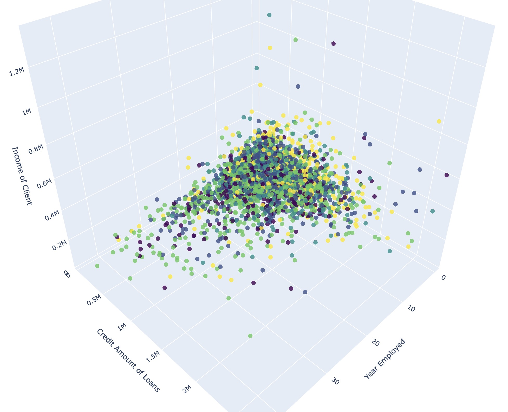

```python
import pandas as pd
import numpy as np
from sklearn.datasets import make_blobs
import random
import matplotlib.pyplot as plt
from yellowbrick.cluster import SilhouetteVisualizer
from sklearn.cluster import KMeans
from sklearn.decomposition import PCA
from matplotlib.ticker import MaxNLocator
import time
import seaborn as sns
from sklearn.impute import KNNImputer
import plotly.express as px
from scipy.cluster.hierarchy import dendrogram, linkage
from sklearn.preprocessing import StandardScaler
from scipy.cluster.hierarchy import fcluster
from fairlearn.metrics import MetricFrame, selection_rate
from sklearn.metrics import f1_score
import seaborn as sns
from sklearn.decomposition import KernelPCA
from scipy.stats import norm
import plotly.graph_objs as go
from sklearn.cluster import AgglomerativeClustering
from scipy.cluster.hierarchy import dendrogram, linkage
from sklearn.metrics import silhouette_score
from sklearn.metrics import davies_bouldin_score
from sklearn.metrics import pairwise_distances
from sklearn import metrics
from kmodes.kprototypes import KPrototypes

```

## Load Data and Data Engineering


```python
df = pd.read_csv("risk_data.csv")
pd.set_option('display.max_columns', None)
df.head()
```


<div>
<style scoped>
    .dataframe tbody tr th:only-of-type {
        vertical-align: middle;
    }

    .dataframe tbody tr th {
        vertical-align: top;
    }

    .dataframe thead th {
        text-align: right;
    }
</style>
<table border="1" class="dataframe">
  <thead>
    <tr style="text-align: right;">
      <th></th>
      <th>SK_ID_CURR</th>
      <th>TARGET</th>
      <th>NAME_CONTRACT_TYPE</th>
      <th>CODE_GENDER</th>
      <th>FLAG_OWN_CAR</th>
      <th>FLAG_OWN_REALTY</th>
      <th>CNT_CHILDREN</th>
      <th>AMT_INCOME_TOTAL</th>
      <th>AMT_CREDIT</th>
      <th>AMT_ANNUITY</th>
      <th>AMT_GOODS_PRICE</th>
      <th>NAME_TYPE_SUITE</th>
      <th>NAME_INCOME_TYPE</th>
      <th>NAME_EDUCATION_TYPE</th>
      <th>NAME_FAMILY_STATUS</th>
      <th>NAME_HOUSING_TYPE</th>
      <th>REGION_POPULATION_RELATIVE</th>
      <th>DAYS_BIRTH</th>
      <th>DAYS_EMPLOYED</th>
      <th>DAYS_REGISTRATION</th>
      <th>DAYS_ID_PUBLISH</th>
      <th>OWN_CAR_AGE</th>
      <th>FLAG_MOBIL</th>
      <th>FLAG_EMP_PHONE</th>
      <th>FLAG_WORK_PHONE</th>
      <th>FLAG_CONT_MOBILE</th>
      <th>FLAG_PHONE</th>
      <th>FLAG_EMAIL</th>
      <th>OCCUPATION_TYPE</th>
      <th>CNT_FAM_MEMBERS</th>
      <th>REGION_RATING_CLIENT</th>
      <th>REGION_RATING_CLIENT_W_CITY</th>
      <th>WEEKDAY_APPR_PROCESS_START</th>
      <th>HOUR_APPR_PROCESS_START</th>
      <th>REG_REGION_NOT_LIVE_REGION</th>
      <th>REG_REGION_NOT_WORK_REGION</th>
      <th>LIVE_REGION_NOT_WORK_REGION</th>
      <th>REG_CITY_NOT_LIVE_CITY</th>
      <th>REG_CITY_NOT_WORK_CITY</th>
      <th>LIVE_CITY_NOT_WORK_CITY</th>
      <th>ORGANIZATION_TYPE</th>
      <th>EXT_SOURCE_1</th>
      <th>EXT_SOURCE_2</th>
      <th>EXT_SOURCE_3</th>
      <th>APARTMENTS_AVG</th>
      <th>BASEMENTAREA_AVG</th>
      <th>YEARS_BEGINEXPLUATATION_AVG</th>
      <th>YEARS_BUILD_AVG</th>
      <th>COMMONAREA_AVG</th>
      <th>ELEVATORS_AVG</th>
      <th>ENTRANCES_AVG</th>
      <th>FLOORSMAX_AVG</th>
      <th>FLOORSMIN_AVG</th>
      <th>LANDAREA_AVG</th>
      <th>LIVINGAPARTMENTS_AVG</th>
      <th>LIVINGAREA_AVG</th>
      <th>NONLIVINGAPARTMENTS_AVG</th>
      <th>NONLIVINGAREA_AVG</th>
      <th>APARTMENTS_MODE</th>
      <th>BASEMENTAREA_MODE</th>
      <th>YEARS_BEGINEXPLUATATION_MODE</th>
      <th>YEARS_BUILD_MODE</th>
      <th>COMMONAREA_MODE</th>
      <th>ELEVATORS_MODE</th>
      <th>ENTRANCES_MODE</th>
      <th>FLOORSMAX_MODE</th>
      <th>FLOORSMIN_MODE</th>
      <th>LANDAREA_MODE</th>
      <th>LIVINGAPARTMENTS_MODE</th>
      <th>LIVINGAREA_MODE</th>
      <th>NONLIVINGAPARTMENTS_MODE</th>
      <th>NONLIVINGAREA_MODE</th>
      <th>APARTMENTS_MEDI</th>
      <th>BASEMENTAREA_MEDI</th>
      <th>YEARS_BEGINEXPLUATATION_MEDI</th>
      <th>YEARS_BUILD_MEDI</th>
      <th>COMMONAREA_MEDI</th>
      <th>ELEVATORS_MEDI</th>
      <th>ENTRANCES_MEDI</th>
      <th>FLOORSMAX_MEDI</th>
      <th>FLOORSMIN_MEDI</th>
      <th>LANDAREA_MEDI</th>
      <th>LIVINGAPARTMENTS_MEDI</th>
      <th>LIVINGAREA_MEDI</th>
      <th>NONLIVINGAPARTMENTS_MEDI</th>
      <th>NONLIVINGAREA_MEDI</th>
      <th>FONDKAPREMONT_MODE</th>
      <th>HOUSETYPE_MODE</th>
      <th>TOTALAREA_MODE</th>
      <th>WALLSMATERIAL_MODE</th>
      <th>EMERGENCYSTATE_MODE</th>
      <th>OBS_30_CNT_SOCIAL_CIRCLE</th>
      <th>DEF_30_CNT_SOCIAL_CIRCLE</th>
      <th>OBS_60_CNT_SOCIAL_CIRCLE</th>
      <th>DEF_60_CNT_SOCIAL_CIRCLE</th>
      <th>DAYS_LAST_PHONE_CHANGE</th>
      <th>FLAG_DOCUMENT_2</th>
      <th>FLAG_DOCUMENT_3</th>
      <th>FLAG_DOCUMENT_4</th>
      <th>FLAG_DOCUMENT_5</th>
      <th>FLAG_DOCUMENT_6</th>
      <th>FLAG_DOCUMENT_7</th>
      <th>FLAG_DOCUMENT_8</th>
      <th>FLAG_DOCUMENT_9</th>
      <th>FLAG_DOCUMENT_10</th>
      <th>FLAG_DOCUMENT_11</th>
      <th>FLAG_DOCUMENT_12</th>
      <th>FLAG_DOCUMENT_13</th>
      <th>FLAG_DOCUMENT_14</th>
      <th>FLAG_DOCUMENT_15</th>
      <th>FLAG_DOCUMENT_16</th>
      <th>FLAG_DOCUMENT_17</th>
      <th>FLAG_DOCUMENT_18</th>
      <th>FLAG_DOCUMENT_19</th>
      <th>FLAG_DOCUMENT_20</th>
      <th>FLAG_DOCUMENT_21</th>
      <th>AMT_REQ_CREDIT_BUREAU_HOUR</th>
      <th>AMT_REQ_CREDIT_BUREAU_DAY</th>
      <th>AMT_REQ_CREDIT_BUREAU_WEEK</th>
      <th>AMT_REQ_CREDIT_BUREAU_MON</th>
      <th>AMT_REQ_CREDIT_BUREAU_QRT</th>
      <th>AMT_REQ_CREDIT_BUREAU_YEAR</th>
    </tr>
  </thead>
  <tbody>
    <tr>
      <th>0</th>
      <td>139346</td>
      <td>1</td>
      <td>Cash loans</td>
      <td>M</td>
      <td>Y</td>
      <td>Y</td>
      <td>0</td>
      <td>450000.0</td>
      <td>1042560.0</td>
      <td>40702.5</td>
      <td>900000.0</td>
      <td>Unaccompanied</td>
      <td>Commercial associate</td>
      <td>Secondary / secondary special</td>
      <td>Married</td>
      <td>Office apartment</td>
      <td>0.014464</td>
      <td>-16584</td>
      <td>-9027</td>
      <td>-4379.0</td>
      <td>-131</td>
      <td>24.0</td>
      <td>1</td>
      <td>1</td>
      <td>0</td>
      <td>1</td>
      <td>0</td>
      <td>1</td>
      <td>NaN</td>
      <td>2.0</td>
      <td>2</td>
      <td>2</td>
      <td>MONDAY</td>
      <td>7</td>
      <td>0</td>
      <td>0</td>
      <td>0</td>
      <td>0</td>
      <td>1</td>
      <td>1</td>
      <td>Business Entity Type 2</td>
      <td>0.333253</td>
      <td>0.510890</td>
      <td>0.340906</td>
      <td>NaN</td>
      <td>NaN</td>
      <td>NaN</td>
      <td>NaN</td>
      <td>NaN</td>
      <td>NaN</td>
      <td>NaN</td>
      <td>NaN</td>
      <td>NaN</td>
      <td>NaN</td>
      <td>NaN</td>
      <td>NaN</td>
      <td>NaN</td>
      <td>NaN</td>
      <td>NaN</td>
      <td>NaN</td>
      <td>NaN</td>
      <td>NaN</td>
      <td>NaN</td>
      <td>NaN</td>
      <td>NaN</td>
      <td>NaN</td>
      <td>NaN</td>
      <td>NaN</td>
      <td>NaN</td>
      <td>NaN</td>
      <td>NaN</td>
      <td>NaN</td>
      <td>NaN</td>
      <td>NaN</td>
      <td>NaN</td>
      <td>NaN</td>
      <td>NaN</td>
      <td>NaN</td>
      <td>NaN</td>
      <td>NaN</td>
      <td>NaN</td>
      <td>NaN</td>
      <td>NaN</td>
      <td>NaN</td>
      <td>NaN</td>
      <td>NaN</td>
      <td>NaN</td>
      <td>NaN</td>
      <td>NaN</td>
      <td>NaN</td>
      <td>NaN</td>
      <td>0.0</td>
      <td>0.0</td>
      <td>0.0</td>
      <td>0.0</td>
      <td>-245.0</td>
      <td>0</td>
      <td>1</td>
      <td>0</td>
      <td>0</td>
      <td>0</td>
      <td>0</td>
      <td>0</td>
      <td>0</td>
      <td>0</td>
      <td>0</td>
      <td>0</td>
      <td>0</td>
      <td>0</td>
      <td>0</td>
      <td>0</td>
      <td>0</td>
      <td>0</td>
      <td>0</td>
      <td>0</td>
      <td>0</td>
      <td>0.0</td>
      <td>0.0</td>
      <td>0.0</td>
      <td>0.0</td>
      <td>0.0</td>
      <td>1.0</td>
    </tr>
    <tr>
      <th>1</th>
      <td>332581</td>
      <td>1</td>
      <td>Cash loans</td>
      <td>F</td>
      <td>N</td>
      <td>Y</td>
      <td>2</td>
      <td>112500.0</td>
      <td>640080.0</td>
      <td>31261.5</td>
      <td>450000.0</td>
      <td>Unaccompanied</td>
      <td>Working</td>
      <td>Secondary / secondary special</td>
      <td>Married</td>
      <td>House / apartment</td>
      <td>0.035792</td>
      <td>-10307</td>
      <td>-3184</td>
      <td>-2268.0</td>
      <td>-2996</td>
      <td>NaN</td>
      <td>1</td>
      <td>1</td>
      <td>0</td>
      <td>1</td>
      <td>0</td>
      <td>0</td>
      <td>NaN</td>
      <td>4.0</td>
      <td>2</td>
      <td>2</td>
      <td>TUESDAY</td>
      <td>12</td>
      <td>0</td>
      <td>0</td>
      <td>0</td>
      <td>0</td>
      <td>1</td>
      <td>1</td>
      <td>Business Entity Type 3</td>
      <td>NaN</td>
      <td>0.548775</td>
      <td>0.450747</td>
      <td>NaN</td>
      <td>NaN</td>
      <td>NaN</td>
      <td>NaN</td>
      <td>NaN</td>
      <td>NaN</td>
      <td>NaN</td>
      <td>NaN</td>
      <td>NaN</td>
      <td>NaN</td>
      <td>NaN</td>
      <td>NaN</td>
      <td>NaN</td>
      <td>NaN</td>
      <td>NaN</td>
      <td>NaN</td>
      <td>NaN</td>
      <td>NaN</td>
      <td>NaN</td>
      <td>NaN</td>
      <td>NaN</td>
      <td>NaN</td>
      <td>NaN</td>
      <td>NaN</td>
      <td>NaN</td>
      <td>NaN</td>
      <td>NaN</td>
      <td>NaN</td>
      <td>NaN</td>
      <td>NaN</td>
      <td>NaN</td>
      <td>NaN</td>
      <td>NaN</td>
      <td>NaN</td>
      <td>NaN</td>
      <td>NaN</td>
      <td>NaN</td>
      <td>NaN</td>
      <td>NaN</td>
      <td>NaN</td>
      <td>NaN</td>
      <td>NaN</td>
      <td>NaN</td>
      <td>NaN</td>
      <td>NaN</td>
      <td>NaN</td>
      <td>NaN</td>
      <td>0.0</td>
      <td>0.0</td>
      <td>0.0</td>
      <td>0.0</td>
      <td>0.0</td>
      <td>0</td>
      <td>1</td>
      <td>0</td>
      <td>0</td>
      <td>0</td>
      <td>0</td>
      <td>0</td>
      <td>0</td>
      <td>0</td>
      <td>0</td>
      <td>0</td>
      <td>0</td>
      <td>0</td>
      <td>0</td>
      <td>0</td>
      <td>0</td>
      <td>0</td>
      <td>0</td>
      <td>0</td>
      <td>0</td>
      <td>0.0</td>
      <td>0.0</td>
      <td>0.0</td>
      <td>0.0</td>
      <td>0.0</td>
      <td>5.0</td>
    </tr>
    <tr>
      <th>2</th>
      <td>101245</td>
      <td>1</td>
      <td>Cash loans</td>
      <td>M</td>
      <td>N</td>
      <td>Y</td>
      <td>1</td>
      <td>112500.0</td>
      <td>314100.0</td>
      <td>19215.0</td>
      <td>225000.0</td>
      <td>Unaccompanied</td>
      <td>Working</td>
      <td>Secondary / secondary special</td>
      <td>Civil marriage</td>
      <td>Rented apartment</td>
      <td>0.006305</td>
      <td>-8402</td>
      <td>-570</td>
      <td>-2736.0</td>
      <td>-803</td>
      <td>NaN</td>
      <td>1</td>
      <td>1</td>
      <td>0</td>
      <td>1</td>
      <td>0</td>
      <td>0</td>
      <td>Security staff</td>
      <td>3.0</td>
      <td>3</td>
      <td>3</td>
      <td>TUESDAY</td>
      <td>5</td>
      <td>0</td>
      <td>0</td>
      <td>0</td>
      <td>1</td>
      <td>1</td>
      <td>1</td>
      <td>Business Entity Type 3</td>
      <td>NaN</td>
      <td>0.146112</td>
      <td>0.380800</td>
      <td>NaN</td>
      <td>NaN</td>
      <td>NaN</td>
      <td>NaN</td>
      <td>NaN</td>
      <td>NaN</td>
      <td>NaN</td>
      <td>NaN</td>
      <td>NaN</td>
      <td>NaN</td>
      <td>NaN</td>
      <td>NaN</td>
      <td>NaN</td>
      <td>NaN</td>
      <td>NaN</td>
      <td>NaN</td>
      <td>NaN</td>
      <td>NaN</td>
      <td>NaN</td>
      <td>NaN</td>
      <td>NaN</td>
      <td>NaN</td>
      <td>NaN</td>
      <td>NaN</td>
      <td>NaN</td>
      <td>NaN</td>
      <td>NaN</td>
      <td>NaN</td>
      <td>NaN</td>
      <td>NaN</td>
      <td>NaN</td>
      <td>NaN</td>
      <td>NaN</td>
      <td>NaN</td>
      <td>NaN</td>
      <td>NaN</td>
      <td>NaN</td>
      <td>NaN</td>
      <td>NaN</td>
      <td>NaN</td>
      <td>NaN</td>
      <td>NaN</td>
      <td>NaN</td>
      <td>NaN</td>
      <td>NaN</td>
      <td>NaN</td>
      <td>NaN</td>
      <td>0.0</td>
      <td>0.0</td>
      <td>0.0</td>
      <td>0.0</td>
      <td>0.0</td>
      <td>0</td>
      <td>1</td>
      <td>0</td>
      <td>0</td>
      <td>0</td>
      <td>0</td>
      <td>0</td>
      <td>0</td>
      <td>0</td>
      <td>0</td>
      <td>0</td>
      <td>0</td>
      <td>0</td>
      <td>0</td>
      <td>0</td>
      <td>0</td>
      <td>0</td>
      <td>0</td>
      <td>0</td>
      <td>0</td>
      <td>0.0</td>
      <td>0.0</td>
      <td>0.0</td>
      <td>0.0</td>
      <td>0.0</td>
      <td>1.0</td>
    </tr>
    <tr>
      <th>3</th>
      <td>186288</td>
      <td>1</td>
      <td>Cash loans</td>
      <td>F</td>
      <td>N</td>
      <td>N</td>
      <td>2</td>
      <td>112500.0</td>
      <td>222547.5</td>
      <td>17842.5</td>
      <td>202500.0</td>
      <td>Unaccompanied</td>
      <td>Working</td>
      <td>Secondary / secondary special</td>
      <td>Married</td>
      <td>Municipal apartment</td>
      <td>0.006008</td>
      <td>-10895</td>
      <td>-1861</td>
      <td>-5022.0</td>
      <td>-733</td>
      <td>NaN</td>
      <td>1</td>
      <td>1</td>
      <td>0</td>
      <td>1</td>
      <td>0</td>
      <td>0</td>
      <td>Cooking staff</td>
      <td>4.0</td>
      <td>2</td>
      <td>2</td>
      <td>MONDAY</td>
      <td>10</td>
      <td>0</td>
      <td>0</td>
      <td>0</td>
      <td>0</td>
      <td>0</td>
      <td>0</td>
      <td>Business Entity Type 2</td>
      <td>NaN</td>
      <td>0.312323</td>
      <td>0.151008</td>
      <td>0.0124</td>
      <td>0.0406</td>
      <td>0.9836</td>
      <td>0.7756</td>
      <td>0.0146</td>
      <td>0.0</td>
      <td>0.069</td>
      <td>0.0417</td>
      <td>0.0833</td>
      <td>NaN</td>
      <td>0.0101</td>
      <td>0.0146</td>
      <td>0.0</td>
      <td>0.0</td>
      <td>0.0126</td>
      <td>0.0422</td>
      <td>0.9836</td>
      <td>0.7844</td>
      <td>0.0147</td>
      <td>0.0</td>
      <td>0.069</td>
      <td>0.0417</td>
      <td>0.0833</td>
      <td>NaN</td>
      <td>0.011</td>
      <td>0.0152</td>
      <td>0.0</td>
      <td>0.0</td>
      <td>0.0125</td>
      <td>0.0406</td>
      <td>0.9836</td>
      <td>0.7786</td>
      <td>0.0147</td>
      <td>0.0</td>
      <td>0.069</td>
      <td>0.0417</td>
      <td>0.0833</td>
      <td>NaN</td>
      <td>0.0103</td>
      <td>0.0149</td>
      <td>0.0</td>
      <td>0.0</td>
      <td>reg oper spec account</td>
      <td>block of flats</td>
      <td>0.0194</td>
      <td>Panel</td>
      <td>No</td>
      <td>2.0</td>
      <td>0.0</td>
      <td>2.0</td>
      <td>0.0</td>
      <td>-720.0</td>
      <td>0</td>
      <td>1</td>
      <td>0</td>
      <td>0</td>
      <td>0</td>
      <td>0</td>
      <td>0</td>
      <td>0</td>
      <td>0</td>
      <td>0</td>
      <td>0</td>
      <td>0</td>
      <td>0</td>
      <td>0</td>
      <td>0</td>
      <td>0</td>
      <td>0</td>
      <td>0</td>
      <td>0</td>
      <td>0</td>
      <td>0.0</td>
      <td>0.0</td>
      <td>0.0</td>
      <td>0.0</td>
      <td>0.0</td>
      <td>3.0</td>
    </tr>
    <tr>
      <th>4</th>
      <td>178513</td>
      <td>1</td>
      <td>Cash loans</td>
      <td>F</td>
      <td>Y</td>
      <td>Y</td>
      <td>2</td>
      <td>67500.0</td>
      <td>582471.0</td>
      <td>28458.0</td>
      <td>409500.0</td>
      <td>Family</td>
      <td>Working</td>
      <td>Lower secondary</td>
      <td>Married</td>
      <td>House / apartment</td>
      <td>0.020246</td>
      <td>-14017</td>
      <td>-723</td>
      <td>-890.0</td>
      <td>-5008</td>
      <td>15.0</td>
      <td>1</td>
      <td>1</td>
      <td>0</td>
      <td>1</td>
      <td>0</td>
      <td>0</td>
      <td>NaN</td>
      <td>4.0</td>
      <td>3</td>
      <td>3</td>
      <td>SATURDAY</td>
      <td>11</td>
      <td>0</td>
      <td>0</td>
      <td>0</td>
      <td>0</td>
      <td>0</td>
      <td>0</td>
      <td>Business Entity Type 3</td>
      <td>NaN</td>
      <td>0.701062</td>
      <td>NaN</td>
      <td>NaN</td>
      <td>NaN</td>
      <td>NaN</td>
      <td>NaN</td>
      <td>NaN</td>
      <td>NaN</td>
      <td>NaN</td>
      <td>NaN</td>
      <td>NaN</td>
      <td>NaN</td>
      <td>NaN</td>
      <td>NaN</td>
      <td>NaN</td>
      <td>NaN</td>
      <td>NaN</td>
      <td>NaN</td>
      <td>NaN</td>
      <td>NaN</td>
      <td>NaN</td>
      <td>NaN</td>
      <td>NaN</td>
      <td>NaN</td>
      <td>NaN</td>
      <td>NaN</td>
      <td>NaN</td>
      <td>NaN</td>
      <td>NaN</td>
      <td>NaN</td>
      <td>NaN</td>
      <td>NaN</td>
      <td>NaN</td>
      <td>NaN</td>
      <td>NaN</td>
      <td>NaN</td>
      <td>NaN</td>
      <td>NaN</td>
      <td>NaN</td>
      <td>NaN</td>
      <td>NaN</td>
      <td>NaN</td>
      <td>NaN</td>
      <td>NaN</td>
      <td>NaN</td>
      <td>NaN</td>
      <td>NaN</td>
      <td>NaN</td>
      <td>NaN</td>
      <td>0.0</td>
      <td>0.0</td>
      <td>0.0</td>
      <td>0.0</td>
      <td>-271.0</td>
      <td>0</td>
      <td>1</td>
      <td>0</td>
      <td>0</td>
      <td>0</td>
      <td>0</td>
      <td>0</td>
      <td>0</td>
      <td>0</td>
      <td>0</td>
      <td>0</td>
      <td>0</td>
      <td>0</td>
      <td>0</td>
      <td>0</td>
      <td>0</td>
      <td>0</td>
      <td>0</td>
      <td>0</td>
      <td>0</td>
      <td>NaN</td>
      <td>NaN</td>
      <td>NaN</td>
      <td>NaN</td>
      <td>NaN</td>
      <td>NaN</td>
    </tr>
  </tbody>
</table>
</div>


```python
# describe the data
df.describe()
```


<div>
<style scoped>
    .dataframe tbody tr th:only-of-type {
        vertical-align: middle;
    }

    .dataframe tbody tr th {
        vertical-align: top;
    }

    .dataframe thead th {
        text-align: right;
    }
</style>
<table border="1" class="dataframe">
  <thead>
    <tr style="text-align: right;">
      <th></th>
      <th>SK_ID_CURR</th>
      <th>TARGET</th>
      <th>CNT_CHILDREN</th>
      <th>AMT_INCOME_TOTAL</th>
      <th>AMT_CREDIT</th>
      <th>AMT_ANNUITY</th>
      <th>AMT_GOODS_PRICE</th>
      <th>REGION_POPULATION_RELATIVE</th>
      <th>DAYS_BIRTH</th>
      <th>DAYS_EMPLOYED</th>
      <th>DAYS_REGISTRATION</th>
      <th>DAYS_ID_PUBLISH</th>
      <th>OWN_CAR_AGE</th>
      <th>FLAG_MOBIL</th>
      <th>FLAG_EMP_PHONE</th>
      <th>FLAG_WORK_PHONE</th>
      <th>FLAG_CONT_MOBILE</th>
      <th>FLAG_PHONE</th>
      <th>FLAG_EMAIL</th>
      <th>CNT_FAM_MEMBERS</th>
      <th>REGION_RATING_CLIENT</th>
      <th>REGION_RATING_CLIENT_W_CITY</th>
      <th>HOUR_APPR_PROCESS_START</th>
      <th>REG_REGION_NOT_LIVE_REGION</th>
      <th>REG_REGION_NOT_WORK_REGION</th>
      <th>LIVE_REGION_NOT_WORK_REGION</th>
      <th>REG_CITY_NOT_LIVE_CITY</th>
      <th>REG_CITY_NOT_WORK_CITY</th>
      <th>LIVE_CITY_NOT_WORK_CITY</th>
      <th>EXT_SOURCE_1</th>
      <th>EXT_SOURCE_2</th>
      <th>EXT_SOURCE_3</th>
      <th>APARTMENTS_AVG</th>
      <th>BASEMENTAREA_AVG</th>
      <th>YEARS_BEGINEXPLUATATION_AVG</th>
      <th>YEARS_BUILD_AVG</th>
      <th>COMMONAREA_AVG</th>
      <th>ELEVATORS_AVG</th>
      <th>ENTRANCES_AVG</th>
      <th>FLOORSMAX_AVG</th>
      <th>FLOORSMIN_AVG</th>
      <th>LANDAREA_AVG</th>
      <th>LIVINGAPARTMENTS_AVG</th>
      <th>LIVINGAREA_AVG</th>
      <th>NONLIVINGAPARTMENTS_AVG</th>
      <th>NONLIVINGAREA_AVG</th>
      <th>APARTMENTS_MODE</th>
      <th>BASEMENTAREA_MODE</th>
      <th>YEARS_BEGINEXPLUATATION_MODE</th>
      <th>YEARS_BUILD_MODE</th>
      <th>COMMONAREA_MODE</th>
      <th>ELEVATORS_MODE</th>
      <th>ENTRANCES_MODE</th>
      <th>FLOORSMAX_MODE</th>
      <th>FLOORSMIN_MODE</th>
      <th>LANDAREA_MODE</th>
      <th>LIVINGAPARTMENTS_MODE</th>
      <th>LIVINGAREA_MODE</th>
      <th>NONLIVINGAPARTMENTS_MODE</th>
      <th>NONLIVINGAREA_MODE</th>
      <th>APARTMENTS_MEDI</th>
      <th>BASEMENTAREA_MEDI</th>
      <th>YEARS_BEGINEXPLUATATION_MEDI</th>
      <th>YEARS_BUILD_MEDI</th>
      <th>COMMONAREA_MEDI</th>
      <th>ELEVATORS_MEDI</th>
      <th>ENTRANCES_MEDI</th>
      <th>FLOORSMAX_MEDI</th>
      <th>FLOORSMIN_MEDI</th>
      <th>LANDAREA_MEDI</th>
      <th>LIVINGAPARTMENTS_MEDI</th>
      <th>LIVINGAREA_MEDI</th>
      <th>NONLIVINGAPARTMENTS_MEDI</th>
      <th>NONLIVINGAREA_MEDI</th>
      <th>TOTALAREA_MODE</th>
      <th>OBS_30_CNT_SOCIAL_CIRCLE</th>
      <th>DEF_30_CNT_SOCIAL_CIRCLE</th>
      <th>OBS_60_CNT_SOCIAL_CIRCLE</th>
      <th>DEF_60_CNT_SOCIAL_CIRCLE</th>
      <th>DAYS_LAST_PHONE_CHANGE</th>
      <th>FLAG_DOCUMENT_2</th>
      <th>FLAG_DOCUMENT_3</th>
      <th>FLAG_DOCUMENT_4</th>
      <th>FLAG_DOCUMENT_5</th>
      <th>FLAG_DOCUMENT_6</th>
      <th>FLAG_DOCUMENT_7</th>
      <th>FLAG_DOCUMENT_8</th>
      <th>FLAG_DOCUMENT_9</th>
      <th>FLAG_DOCUMENT_10</th>
      <th>FLAG_DOCUMENT_11</th>
      <th>FLAG_DOCUMENT_12</th>
      <th>FLAG_DOCUMENT_13</th>
      <th>FLAG_DOCUMENT_14</th>
      <th>FLAG_DOCUMENT_15</th>
      <th>FLAG_DOCUMENT_16</th>
      <th>FLAG_DOCUMENT_17</th>
      <th>FLAG_DOCUMENT_18</th>
      <th>FLAG_DOCUMENT_19</th>
      <th>FLAG_DOCUMENT_20</th>
      <th>FLAG_DOCUMENT_21</th>
      <th>AMT_REQ_CREDIT_BUREAU_HOUR</th>
      <th>AMT_REQ_CREDIT_BUREAU_DAY</th>
      <th>AMT_REQ_CREDIT_BUREAU_WEEK</th>
      <th>AMT_REQ_CREDIT_BUREAU_MON</th>
      <th>AMT_REQ_CREDIT_BUREAU_QRT</th>
      <th>AMT_REQ_CREDIT_BUREAU_YEAR</th>
    </tr>
  </thead>
  <tbody>
    <tr>
      <th>count</th>
      <td>5042.000000</td>
      <td>5042.000000</td>
      <td>5042.000000</td>
      <td>5.042000e+03</td>
      <td>5.042000e+03</td>
      <td>5042.000000</td>
      <td>5.041000e+03</td>
      <td>5042.000000</td>
      <td>5042.000000</td>
      <td>5042.000000</td>
      <td>5042.000000</td>
      <td>5042.000000</td>
      <td>1897.000000</td>
      <td>5042.0</td>
      <td>5042.0</td>
      <td>5042.000000</td>
      <td>5042.000000</td>
      <td>5042.000000</td>
      <td>5042.000000</td>
      <td>5042.000000</td>
      <td>5042.000000</td>
      <td>5042.000000</td>
      <td>5042.000000</td>
      <td>5042.000000</td>
      <td>5042.000000</td>
      <td>5042.000000</td>
      <td>5042.000000</td>
      <td>5042.000000</td>
      <td>5042.000000</td>
      <td>2396.000000</td>
      <td>5032.000000</td>
      <td>4054.000000</td>
      <td>2517.000000</td>
      <td>2133.000000</td>
      <td>2630.000000</td>
      <td>1698.000000</td>
      <td>1527.00000</td>
      <td>2401.000000</td>
      <td>2551.000000</td>
      <td>2576.000000</td>
      <td>1617.000000</td>
      <td>2115.000000</td>
      <td>1604.000000</td>
      <td>2583.000000</td>
      <td>1541.000000</td>
      <td>2305.000000</td>
      <td>2517.000000</td>
      <td>2133.000000</td>
      <td>2630.000000</td>
      <td>1698.000000</td>
      <td>1527.000000</td>
      <td>2401.000000</td>
      <td>2551.000000</td>
      <td>2576.000000</td>
      <td>1617.000000</td>
      <td>2115.000000</td>
      <td>1604.000000</td>
      <td>2583.000000</td>
      <td>1541.000000</td>
      <td>2305.000000</td>
      <td>2517.000000</td>
      <td>2133.000000</td>
      <td>2630.000000</td>
      <td>1698.000000</td>
      <td>1527.000000</td>
      <td>2401.000000</td>
      <td>2551.000000</td>
      <td>2576.000000</td>
      <td>1617.000000</td>
      <td>2115.000000</td>
      <td>1604.000000</td>
      <td>2583.000000</td>
      <td>1541.000000</td>
      <td>2305.000000</td>
      <td>2660.000000</td>
      <td>5026.000000</td>
      <td>5026.000000</td>
      <td>5026.000000</td>
      <td>5026.000000</td>
      <td>5042.000000</td>
      <td>5042.0</td>
      <td>5042.000000</td>
      <td>5042.0</td>
      <td>5042.000000</td>
      <td>5042.000000</td>
      <td>5042.000000</td>
      <td>5042.000000</td>
      <td>5042.000000</td>
      <td>5042.0</td>
      <td>5042.000000</td>
      <td>5042.0</td>
      <td>5042.000000</td>
      <td>5042.000000</td>
      <td>5042.000000</td>
      <td>5042.000000</td>
      <td>5042.000000</td>
      <td>5042.000000</td>
      <td>5042.000000</td>
      <td>5042.000000</td>
      <td>5042.000000</td>
      <td>4376.000000</td>
      <td>4376.000000</td>
      <td>4376.000000</td>
      <td>4376.000000</td>
      <td>4376.000000</td>
      <td>4376.000000</td>
    </tr>
    <tr>
      <th>mean</th>
      <td>279907.116224</td>
      <td>0.086474</td>
      <td>0.470250</td>
      <td>1.773172e+05</td>
      <td>6.226787e+05</td>
      <td>28181.309798</td>
      <td>5.586754e+05</td>
      <td>0.021105</td>
      <td>-14895.446648</td>
      <td>-2395.756446</td>
      <td>-4705.280246</td>
      <td>-2811.930980</td>
      <td>12.255667</td>
      <td>1.0</td>
      <td>1.0</td>
      <td>0.233439</td>
      <td>0.998612</td>
      <td>0.274296</td>
      <td>0.065252</td>
      <td>2.214002</td>
      <td>2.039072</td>
      <td>2.018842</td>
      <td>12.270131</td>
      <td>0.023205</td>
      <td>0.070607</td>
      <td>0.055335</td>
      <td>0.094407</td>
      <td>0.282824</td>
      <td>0.222729</td>
      <td>0.482340</td>
      <td>0.519788</td>
      <td>0.499784</td>
      <td>0.120411</td>
      <td>0.086400</td>
      <td>0.979276</td>
      <td>0.750574</td>
      <td>0.04270</td>
      <td>0.081442</td>
      <td>0.147874</td>
      <td>0.228883</td>
      <td>0.232638</td>
      <td>0.066993</td>
      <td>0.101252</td>
      <td>0.108798</td>
      <td>0.009649</td>
      <td>0.030322</td>
      <td>0.116817</td>
      <td>0.085002</td>
      <td>0.978505</td>
      <td>0.757588</td>
      <td>0.040401</td>
      <td>0.076543</td>
      <td>0.143185</td>
      <td>0.224598</td>
      <td>0.228015</td>
      <td>0.065861</td>
      <td>0.105398</td>
      <td>0.106980</td>
      <td>0.008682</td>
      <td>0.028497</td>
      <td>0.120894</td>
      <td>0.085705</td>
      <td>0.979397</td>
      <td>0.754021</td>
      <td>0.042664</td>
      <td>0.080525</td>
      <td>0.147293</td>
      <td>0.228681</td>
      <td>0.232653</td>
      <td>0.068011</td>
      <td>0.102413</td>
      <td>0.109998</td>
      <td>0.009463</td>
      <td>0.029964</td>
      <td>0.103671</td>
      <td>1.482491</td>
      <td>0.144449</td>
      <td>1.462793</td>
      <td>0.098289</td>
      <td>-972.021023</td>
      <td>0.0</td>
      <td>0.758231</td>
      <td>0.0</td>
      <td>0.015470</td>
      <td>0.008727</td>
      <td>0.000198</td>
      <td>0.105315</td>
      <td>0.005752</td>
      <td>0.0</td>
      <td>0.004958</td>
      <td>0.0</td>
      <td>0.003967</td>
      <td>0.004363</td>
      <td>0.000793</td>
      <td>0.011107</td>
      <td>0.000595</td>
      <td>0.008727</td>
      <td>0.000992</td>
      <td>0.000992</td>
      <td>0.000397</td>
      <td>0.006170</td>
      <td>0.009141</td>
      <td>0.037020</td>
      <td>0.281536</td>
      <td>0.248629</td>
      <td>1.874314</td>
    </tr>
    <tr>
      <th>std</th>
      <td>103244.272079</td>
      <td>0.281090</td>
      <td>0.720108</td>
      <td>1.004194e+05</td>
      <td>4.155689e+05</td>
      <td>15024.595611</td>
      <td>3.806711e+05</td>
      <td>0.014095</td>
      <td>3700.295126</td>
      <td>2397.824075</td>
      <td>3261.251558</td>
      <td>1506.875724</td>
      <td>12.102259</td>
      <td>0.0</td>
      <td>0.0</td>
      <td>0.423061</td>
      <td>0.037238</td>
      <td>0.446203</td>
      <td>0.246994</td>
      <td>0.905809</td>
      <td>0.522705</td>
      <td>0.516963</td>
      <td>3.331934</td>
      <td>0.150569</td>
      <td>0.256192</td>
      <td>0.228656</td>
      <td>0.292423</td>
      <td>0.450416</td>
      <td>0.416119</td>
      <td>0.206597</td>
      <td>0.189472</td>
      <td>0.197539</td>
      <td>0.112689</td>
      <td>0.084833</td>
      <td>0.045558</td>
      <td>0.116173</td>
      <td>0.06209</td>
      <td>0.136842</td>
      <td>0.097999</td>
      <td>0.148691</td>
      <td>0.159625</td>
      <td>0.084364</td>
      <td>0.095641</td>
      <td>0.116289</td>
      <td>0.052551</td>
      <td>0.079042</td>
      <td>0.110830</td>
      <td>0.086431</td>
      <td>0.052450</td>
      <td>0.113279</td>
      <td>0.060047</td>
      <td>0.132753</td>
      <td>0.098906</td>
      <td>0.148389</td>
      <td>0.160413</td>
      <td>0.086005</td>
      <td>0.099160</td>
      <td>0.116225</td>
      <td>0.050864</td>
      <td>0.076508</td>
      <td>0.113124</td>
      <td>0.084376</td>
      <td>0.045114</td>
      <td>0.114606</td>
      <td>0.062440</td>
      <td>0.136175</td>
      <td>0.098060</td>
      <td>0.149514</td>
      <td>0.160693</td>
      <td>0.085971</td>
      <td>0.096920</td>
      <td>0.117098</td>
      <td>0.052396</td>
      <td>0.079103</td>
      <td>0.110676</td>
      <td>2.407491</td>
      <td>0.440518</td>
      <td>2.385343</td>
      <td>0.355608</td>
      <td>833.903862</td>
      <td>0.0</td>
      <td>0.428198</td>
      <td>0.0</td>
      <td>0.123425</td>
      <td>0.093018</td>
      <td>0.014083</td>
      <td>0.306990</td>
      <td>0.075629</td>
      <td>0.0</td>
      <td>0.070248</td>
      <td>0.0</td>
      <td>0.062863</td>
      <td>0.065918</td>
      <td>0.028158</td>
      <td>0.104812</td>
      <td>0.024388</td>
      <td>0.093018</td>
      <td>0.031478</td>
      <td>0.031478</td>
      <td>0.019915</td>
      <td>0.078316</td>
      <td>0.149387</td>
      <td>0.212739</td>
      <td>0.883519</td>
      <td>0.580343</td>
      <td>1.815418</td>
    </tr>
    <tr>
      <th>min</th>
      <td>100020.000000</td>
      <td>0.000000</td>
      <td>0.000000</td>
      <td>3.510000e+04</td>
      <td>4.500000e+04</td>
      <td>2673.000000</td>
      <td>4.500000e+04</td>
      <td>0.000533</td>
      <td>-25126.000000</td>
      <td>-16121.000000</td>
      <td>-18294.000000</td>
      <td>-6207.000000</td>
      <td>0.000000</td>
      <td>1.0</td>
      <td>1.0</td>
      <td>0.000000</td>
      <td>0.000000</td>
      <td>0.000000</td>
      <td>0.000000</td>
      <td>1.000000</td>
      <td>1.000000</td>
      <td>1.000000</td>
      <td>0.000000</td>
      <td>0.000000</td>
      <td>0.000000</td>
      <td>0.000000</td>
      <td>0.000000</td>
      <td>0.000000</td>
      <td>0.000000</td>
      <td>0.021693</td>
      <td>0.000370</td>
      <td>0.000527</td>
      <td>0.000000</td>
      <td>0.000000</td>
      <td>0.000000</td>
      <td>0.000000</td>
      <td>0.00000</td>
      <td>0.000000</td>
      <td>0.000000</td>
      <td>0.000000</td>
      <td>0.000000</td>
      <td>0.000000</td>
      <td>0.000000</td>
      <td>0.000000</td>
      <td>0.000000</td>
      <td>0.000000</td>
      <td>0.000000</td>
      <td>0.000000</td>
      <td>0.000000</td>
      <td>0.000000</td>
      <td>0.000000</td>
      <td>0.000000</td>
      <td>0.000000</td>
      <td>0.000000</td>
      <td>0.000000</td>
      <td>0.000000</td>
      <td>0.000000</td>
      <td>0.000000</td>
      <td>0.000000</td>
      <td>0.000000</td>
      <td>0.000000</td>
      <td>0.000000</td>
      <td>0.000000</td>
      <td>0.000000</td>
      <td>0.000000</td>
      <td>0.000000</td>
      <td>0.000000</td>
      <td>0.000000</td>
      <td>0.000000</td>
      <td>0.000000</td>
      <td>0.000000</td>
      <td>0.000000</td>
      <td>0.000000</td>
      <td>0.000000</td>
      <td>0.000000</td>
      <td>0.000000</td>
      <td>0.000000</td>
      <td>0.000000</td>
      <td>0.000000</td>
      <td>-3736.000000</td>
      <td>0.0</td>
      <td>0.000000</td>
      <td>0.0</td>
      <td>0.000000</td>
      <td>0.000000</td>
      <td>0.000000</td>
      <td>0.000000</td>
      <td>0.000000</td>
      <td>0.0</td>
      <td>0.000000</td>
      <td>0.0</td>
      <td>0.000000</td>
      <td>0.000000</td>
      <td>0.000000</td>
      <td>0.000000</td>
      <td>0.000000</td>
      <td>0.000000</td>
      <td>0.000000</td>
      <td>0.000000</td>
      <td>0.000000</td>
      <td>0.000000</td>
      <td>0.000000</td>
      <td>0.000000</td>
      <td>0.000000</td>
      <td>0.000000</td>
      <td>0.000000</td>
    </tr>
    <tr>
      <th>25%</th>
      <td>190899.250000</td>
      <td>0.000000</td>
      <td>0.000000</td>
      <td>1.125000e+05</td>
      <td>2.792925e+05</td>
      <td>17077.500000</td>
      <td>2.475000e+05</td>
      <td>0.010006</td>
      <td>-17793.750000</td>
      <td>-3184.750000</td>
      <td>-7121.750000</td>
      <td>-4172.750000</td>
      <td>5.000000</td>
      <td>1.0</td>
      <td>1.0</td>
      <td>0.000000</td>
      <td>1.000000</td>
      <td>0.000000</td>
      <td>0.000000</td>
      <td>2.000000</td>
      <td>2.000000</td>
      <td>2.000000</td>
      <td>10.000000</td>
      <td>0.000000</td>
      <td>0.000000</td>
      <td>0.000000</td>
      <td>0.000000</td>
      <td>0.000000</td>
      <td>0.000000</td>
      <td>0.321264</td>
      <td>0.406249</td>
      <td>0.357293</td>
      <td>0.057700</td>
      <td>0.040900</td>
      <td>0.976700</td>
      <td>0.687200</td>
      <td>0.00750</td>
      <td>0.000000</td>
      <td>0.069000</td>
      <td>0.166700</td>
      <td>0.083300</td>
      <td>0.017400</td>
      <td>0.050400</td>
      <td>0.042150</td>
      <td>0.000000</td>
      <td>0.000000</td>
      <td>0.052500</td>
      <td>0.037100</td>
      <td>0.976700</td>
      <td>0.692900</td>
      <td>0.006800</td>
      <td>0.000000</td>
      <td>0.069000</td>
      <td>0.166700</td>
      <td>0.083300</td>
      <td>0.015300</td>
      <td>0.054200</td>
      <td>0.041250</td>
      <td>0.000000</td>
      <td>0.000000</td>
      <td>0.058300</td>
      <td>0.040600</td>
      <td>0.976700</td>
      <td>0.691400</td>
      <td>0.007500</td>
      <td>0.000000</td>
      <td>0.069000</td>
      <td>0.166700</td>
      <td>0.083300</td>
      <td>0.017200</td>
      <td>0.051300</td>
      <td>0.043000</td>
      <td>0.000000</td>
      <td>0.000000</td>
      <td>0.041175</td>
      <td>0.000000</td>
      <td>0.000000</td>
      <td>0.000000</td>
      <td>0.000000</td>
      <td>-1599.000000</td>
      <td>0.0</td>
      <td>1.000000</td>
      <td>0.0</td>
      <td>0.000000</td>
      <td>0.000000</td>
      <td>0.000000</td>
      <td>0.000000</td>
      <td>0.000000</td>
      <td>0.0</td>
      <td>0.000000</td>
      <td>0.0</td>
      <td>0.000000</td>
      <td>0.000000</td>
      <td>0.000000</td>
      <td>0.000000</td>
      <td>0.000000</td>
      <td>0.000000</td>
      <td>0.000000</td>
      <td>0.000000</td>
      <td>0.000000</td>
      <td>0.000000</td>
      <td>0.000000</td>
      <td>0.000000</td>
      <td>0.000000</td>
      <td>0.000000</td>
      <td>0.000000</td>
    </tr>
    <tr>
      <th>50%</th>
      <td>279541.500000</td>
      <td>0.000000</td>
      <td>0.000000</td>
      <td>1.575000e+05</td>
      <td>5.336685e+05</td>
      <td>26217.000000</td>
      <td>4.500000e+05</td>
      <td>0.018850</td>
      <td>-14742.000000</td>
      <td>-1649.000000</td>
      <td>-4288.000000</td>
      <td>-2892.000000</td>
      <td>9.000000</td>
      <td>1.0</td>
      <td>1.0</td>
      <td>0.000000</td>
      <td>1.000000</td>
      <td>0.000000</td>
      <td>0.000000</td>
      <td>2.000000</td>
      <td>2.000000</td>
      <td>2.000000</td>
      <td>12.000000</td>
      <td>0.000000</td>
      <td>0.000000</td>
      <td>0.000000</td>
      <td>0.000000</td>
      <td>0.000000</td>
      <td>0.000000</td>
      <td>0.476951</td>
      <td>0.573680</td>
      <td>0.524496</td>
      <td>0.090700</td>
      <td>0.075200</td>
      <td>0.981600</td>
      <td>0.755200</td>
      <td>0.02000</td>
      <td>0.000000</td>
      <td>0.137900</td>
      <td>0.166700</td>
      <td>0.208300</td>
      <td>0.047300</td>
      <td>0.075600</td>
      <td>0.074500</td>
      <td>0.000000</td>
      <td>0.003800</td>
      <td>0.084000</td>
      <td>0.073900</td>
      <td>0.981600</td>
      <td>0.758300</td>
      <td>0.017900</td>
      <td>0.000000</td>
      <td>0.137900</td>
      <td>0.166700</td>
      <td>0.208300</td>
      <td>0.044300</td>
      <td>0.077600</td>
      <td>0.072700</td>
      <td>0.000000</td>
      <td>0.001300</td>
      <td>0.090600</td>
      <td>0.074600</td>
      <td>0.981600</td>
      <td>0.758500</td>
      <td>0.019800</td>
      <td>0.000000</td>
      <td>0.137900</td>
      <td>0.166700</td>
      <td>0.208300</td>
      <td>0.047900</td>
      <td>0.077000</td>
      <td>0.075000</td>
      <td>0.000000</td>
      <td>0.003300</td>
      <td>0.069150</td>
      <td>0.000000</td>
      <td>0.000000</td>
      <td>0.000000</td>
      <td>0.000000</td>
      <td>-750.500000</td>
      <td>0.0</td>
      <td>1.000000</td>
      <td>0.0</td>
      <td>0.000000</td>
      <td>0.000000</td>
      <td>0.000000</td>
      <td>0.000000</td>
      <td>0.000000</td>
      <td>0.0</td>
      <td>0.000000</td>
      <td>0.0</td>
      <td>0.000000</td>
      <td>0.000000</td>
      <td>0.000000</td>
      <td>0.000000</td>
      <td>0.000000</td>
      <td>0.000000</td>
      <td>0.000000</td>
      <td>0.000000</td>
      <td>0.000000</td>
      <td>0.000000</td>
      <td>0.000000</td>
      <td>0.000000</td>
      <td>0.000000</td>
      <td>0.000000</td>
      <td>1.000000</td>
    </tr>
    <tr>
      <th>75%</th>
      <td>369669.000000</td>
      <td>0.000000</td>
      <td>1.000000</td>
      <td>2.205000e+05</td>
      <td>8.409960e+05</td>
      <td>35937.000000</td>
      <td>7.110000e+05</td>
      <td>0.028663</td>
      <td>-11850.250000</td>
      <td>-746.000000</td>
      <td>-1957.250000</td>
      <td>-1521.000000</td>
      <td>15.000000</td>
      <td>1.0</td>
      <td>1.0</td>
      <td>0.000000</td>
      <td>1.000000</td>
      <td>1.000000</td>
      <td>0.000000</td>
      <td>3.000000</td>
      <td>2.000000</td>
      <td>2.000000</td>
      <td>15.000000</td>
      <td>0.000000</td>
      <td>0.000000</td>
      <td>0.000000</td>
      <td>0.000000</td>
      <td>1.000000</td>
      <td>0.000000</td>
      <td>0.649117</td>
      <td>0.666096</td>
      <td>0.657784</td>
      <td>0.148500</td>
      <td>0.111700</td>
      <td>0.986975</td>
      <td>0.816400</td>
      <td>0.05335</td>
      <td>0.120000</td>
      <td>0.206900</td>
      <td>0.333300</td>
      <td>0.375000</td>
      <td>0.085100</td>
      <td>0.121000</td>
      <td>0.135700</td>
      <td>0.003900</td>
      <td>0.029900</td>
      <td>0.148100</td>
      <td>0.112100</td>
      <td>0.986600</td>
      <td>0.823600</td>
      <td>0.051050</td>
      <td>0.120800</td>
      <td>0.206900</td>
      <td>0.333300</td>
      <td>0.375000</td>
      <td>0.083400</td>
      <td>0.130400</td>
      <td>0.130900</td>
      <td>0.003900</td>
      <td>0.025500</td>
      <td>0.149900</td>
      <td>0.110300</td>
      <td>0.987100</td>
      <td>0.818900</td>
      <td>0.053450</td>
      <td>0.120000</td>
      <td>0.206900</td>
      <td>0.333300</td>
      <td>0.375000</td>
      <td>0.086750</td>
      <td>0.123100</td>
      <td>0.135200</td>
      <td>0.003900</td>
      <td>0.029300</td>
      <td>0.133200</td>
      <td>2.000000</td>
      <td>0.000000</td>
      <td>2.000000</td>
      <td>0.000000</td>
      <td>-288.000000</td>
      <td>0.0</td>
      <td>1.000000</td>
      <td>0.0</td>
      <td>0.000000</td>
      <td>0.000000</td>
      <td>0.000000</td>
      <td>0.000000</td>
      <td>0.000000</td>
      <td>0.0</td>
      <td>0.000000</td>
      <td>0.0</td>
      <td>0.000000</td>
      <td>0.000000</td>
      <td>0.000000</td>
      <td>0.000000</td>
      <td>0.000000</td>
      <td>0.000000</td>
      <td>0.000000</td>
      <td>0.000000</td>
      <td>0.000000</td>
      <td>0.000000</td>
      <td>0.000000</td>
      <td>0.000000</td>
      <td>0.000000</td>
      <td>0.000000</td>
      <td>3.000000</td>
    </tr>
    <tr>
      <th>max</th>
      <td>456248.000000</td>
      <td>1.000000</td>
      <td>4.000000</td>
      <td>1.350000e+06</td>
      <td>2.700000e+06</td>
      <td>225000.000000</td>
      <td>2.700000e+06</td>
      <td>0.072508</td>
      <td>-7678.000000</td>
      <td>-9.000000</td>
      <td>0.000000</td>
      <td>-1.000000</td>
      <td>65.000000</td>
      <td>1.0</td>
      <td>1.0</td>
      <td>1.000000</td>
      <td>1.000000</td>
      <td>1.000000</td>
      <td>1.000000</td>
      <td>6.000000</td>
      <td>3.000000</td>
      <td>3.000000</td>
      <td>23.000000</td>
      <td>1.000000</td>
      <td>1.000000</td>
      <td>1.000000</td>
      <td>1.000000</td>
      <td>1.000000</td>
      <td>1.000000</td>
      <td>0.932577</td>
      <td>0.809170</td>
      <td>0.893976</td>
      <td>1.000000</td>
      <td>1.000000</td>
      <td>1.000000</td>
      <td>1.000000</td>
      <td>0.63470</td>
      <td>1.000000</td>
      <td>1.000000</td>
      <td>1.000000</td>
      <td>1.000000</td>
      <td>1.000000</td>
      <td>1.000000</td>
      <td>1.000000</td>
      <td>1.000000</td>
      <td>1.000000</td>
      <td>1.000000</td>
      <td>1.000000</td>
      <td>1.000000</td>
      <td>1.000000</td>
      <td>0.640500</td>
      <td>1.000000</td>
      <td>1.000000</td>
      <td>1.000000</td>
      <td>1.000000</td>
      <td>1.000000</td>
      <td>1.000000</td>
      <td>1.000000</td>
      <td>1.000000</td>
      <td>1.000000</td>
      <td>1.000000</td>
      <td>1.000000</td>
      <td>1.000000</td>
      <td>1.000000</td>
      <td>0.638700</td>
      <td>1.000000</td>
      <td>1.000000</td>
      <td>1.000000</td>
      <td>1.000000</td>
      <td>1.000000</td>
      <td>1.000000</td>
      <td>1.000000</td>
      <td>1.000000</td>
      <td>1.000000</td>
      <td>1.000000</td>
      <td>24.000000</td>
      <td>6.000000</td>
      <td>24.000000</td>
      <td>6.000000</td>
      <td>0.000000</td>
      <td>0.0</td>
      <td>1.000000</td>
      <td>0.0</td>
      <td>1.000000</td>
      <td>1.000000</td>
      <td>1.000000</td>
      <td>1.000000</td>
      <td>1.000000</td>
      <td>0.0</td>
      <td>1.000000</td>
      <td>0.0</td>
      <td>1.000000</td>
      <td>1.000000</td>
      <td>1.000000</td>
      <td>1.000000</td>
      <td>1.000000</td>
      <td>1.000000</td>
      <td>1.000000</td>
      <td>1.000000</td>
      <td>1.000000</td>
      <td>1.000000</td>
      <td>5.000000</td>
      <td>5.000000</td>
      <td>13.000000</td>
      <td>5.000000</td>
      <td>11.000000</td>
    </tr>
  </tbody>
</table>
</div>


```python
# drop unnecessary columns
drop = ["SK_ID_CURR", "OWN_CAR_AGE", "FLAG_EMP_PHONE", "FLAG_WORK_PHONE", "FLAG_CONT_MOBILE", "FLAG_PHONE", "EXT_SOURCE_1", "EXT_SOURCE_2", "EXT_SOURCE_3", "BASEMENTAREA_AVG", "YEARS_BEGINEXPLUATATION_AVG",	"YEARS_BUILD_AVG",	"COMMONAREA_AVG", "ELEVATORS_AVG", "ENTRANCES_AVG", "FLOORSMAX_AVG", "FLOORSMIN_AVG", 	"LANDAREA_AVG",	"LIVINGAPARTMENTS_AVG",	"LIVINGAREA_AVG", "NONLIVINGAPARTMENTS_AVG","NONLIVINGAREA_AVG","APARTMENTS_MODE"	,"BASEMENTAREA_MODE",'YEARS_BEGINEXPLUATATION_MODE',	"YEARS_BUILD_MODE",	"COMMONAREA_MODE",	"ELEVATORS_MODE",	"ENTRANCES_MODE",	"FLOORSMAX_MODE",	"FLOORSMIN_MODE",	"LANDAREA_MODE",'LIVINGAPARTMENTS_MODE', 	"LIVINGAREA_MODE",	"NONLIVINGAPARTMENTS_MODE",	"NONLIVINGAREA_MODE",	"APARTMENTS_MEDI",	"BASEMENTAREA_MEDI",	"YEARS_BEGINEXPLUATATION_MEDI",	"YEARS_BUILD_MEDI",	"COMMONAREA_MEDI",	"ELEVATORS_MEDI",	"ENTRANCES_MEDI",	"FLOORSMAX_MEDI",	"FLOORSMIN_MEDI",	"LANDAREA_MEDI",	"LIVINGAPARTMENTS_MEDI",
"LIVINGAREA_MEDI",	"NONLIVINGAPARTMENTS_MEDI",	"NONLIVINGAREA_MEDI",	"TOTALAREA_MODE",	"OBS_30_CNT_SOCIAL_CIRCLE",	"DEF_30_CNT_SOCIAL_CIRCLE",	"OBS_60_CNT_SOCIAL_CIRCLE",	"DEF_60_CNT_SOCIAL_CIRCLE",	"DAYS_LAST_PHONE_CHANGE",	"FLAG_DOCUMENT_2",	"FLAG_DOCUMENT_3",	"FLAG_DOCUMENT_4",	"FLAG_DOCUMENT_5",	"FLAG_DOCUMENT_6",	"FLAG_DOCUMENT_7",	"FLAG_DOCUMENT_8",	"FLAG_DOCUMENT_9",	"FLAG_DOCUMENT_10",	"FLAG_DOCUMENT_11",	"FLAG_DOCUMENT_12",	"FLAG_DOCUMENT_13",	"FLAG_DOCUMENT_14",	"FLAG_DOCUMENT_15",	"FLAG_DOCUMENT_16",	"FLAG_DOCUMENT_17",	"FLAG_DOCUMENT_18",	"FLAG_DOCUMENT_19",	"FLAG_DOCUMENT_20",	"FLAG_DOCUMENT_21"]

df.drop(drop, axis=1, inplace=True)
drop_1 = ["APARTMENTS_AVG", "FONDKAPREMONT_MODE", "HOUSETYPE_MODE", "WALLSMATERIAL_MODE", "EMERGENCYSTATE_MODE", "OCCUPATION_TYPE", "FLAG_MOBIL", "FLAG_EMAIL"]
df.drop(drop_1, axis=1, inplace=True)
df = df.dropna()
df.shape
```


    (4363, 38)


```python
# divide numerical and categorical data
numeric_features = list(df.select_dtypes("float64").columns)
int_features = list(df.select_dtypes("int64").columns)
categorical_features = list(df.select_dtypes(include = ["category", "object"]).columns)
print(f'numeric_features:\n{numeric_features}\n\ncategorical_features:\n{categorical_features}')
```

    numeric_features:
    ['AMT_INCOME_TOTAL', 'AMT_CREDIT', 'AMT_ANNUITY', 'AMT_GOODS_PRICE', 'REGION_POPULATION_RELATIVE', 'DAYS_REGISTRATION', 'CNT_FAM_MEMBERS', 'AMT_REQ_CREDIT_BUREAU_HOUR', 'AMT_REQ_CREDIT_BUREAU_DAY', 'AMT_REQ_CREDIT_BUREAU_WEEK', 'AMT_REQ_CREDIT_BUREAU_MON', 'AMT_REQ_CREDIT_BUREAU_QRT', 'AMT_REQ_CREDIT_BUREAU_YEAR']
    
    categorical_features:
    ['NAME_CONTRACT_TYPE', 'CODE_GENDER', 'FLAG_OWN_CAR', 'FLAG_OWN_REALTY', 'NAME_TYPE_SUITE', 'NAME_INCOME_TYPE', 'NAME_EDUCATION_TYPE', 'NAME_FAMILY_STATUS', 'NAME_HOUSING_TYPE', 'WEEKDAY_APPR_PROCESS_START', 'ORGANIZATION_TYPE']


```python
df_numerical = df[numeric_features + int_features[1:7]]
df_categorical = df[categorical_features + int_features[0:1] + int_features[7:]]
```


```python
# normalize data
df_numerical_norm  = (df_numerical-  df_numerical.min())/(df_numerical.max() - df_numerical.min())
df_numerical_norm
```


<div>
<style scoped>
    .dataframe tbody tr th:only-of-type {
        vertical-align: middle;
    }

    .dataframe tbody tr th {
        vertical-align: top;
    }

    .dataframe thead th {
        text-align: right;
    }
</style>
<table border="1" class="dataframe">
  <thead>
    <tr style="text-align: right;">
      <th></th>
      <th>AMT_INCOME_TOTAL</th>
      <th>AMT_CREDIT</th>
      <th>AMT_ANNUITY</th>
      <th>AMT_GOODS_PRICE</th>
      <th>REGION_POPULATION_RELATIVE</th>
      <th>DAYS_REGISTRATION</th>
      <th>CNT_FAM_MEMBERS</th>
      <th>AMT_REQ_CREDIT_BUREAU_HOUR</th>
      <th>AMT_REQ_CREDIT_BUREAU_DAY</th>
      <th>AMT_REQ_CREDIT_BUREAU_WEEK</th>
      <th>AMT_REQ_CREDIT_BUREAU_MON</th>
      <th>AMT_REQ_CREDIT_BUREAU_QRT</th>
      <th>AMT_REQ_CREDIT_BUREAU_YEAR</th>
      <th>CNT_CHILDREN</th>
      <th>DAYS_BIRTH</th>
      <th>DAYS_EMPLOYED</th>
      <th>DAYS_ID_PUBLISH</th>
      <th>REGION_RATING_CLIENT</th>
      <th>REGION_RATING_CLIENT_W_CITY</th>
    </tr>
  </thead>
  <tbody>
    <tr>
      <th>0</th>
      <td>0.315537</td>
      <td>0.375729</td>
      <td>0.171052</td>
      <td>0.322034</td>
      <td>0.193553</td>
      <td>0.760757</td>
      <td>0.2</td>
      <td>0.0</td>
      <td>0.0</td>
      <td>0.0</td>
      <td>0.0</td>
      <td>0.0</td>
      <td>0.090909</td>
      <td>0.00</td>
      <td>0.490779</td>
      <td>0.431077</td>
      <td>0.979053</td>
      <td>0.5</td>
      <td>0.5</td>
    </tr>
    <tr>
      <th>1</th>
      <td>0.058864</td>
      <td>0.224136</td>
      <td>0.128588</td>
      <td>0.152542</td>
      <td>0.489878</td>
      <td>0.876169</td>
      <td>0.6</td>
      <td>0.0</td>
      <td>0.0</td>
      <td>0.0</td>
      <td>0.0</td>
      <td>0.0</td>
      <td>0.454545</td>
      <td>0.50</td>
      <td>0.851422</td>
      <td>0.799697</td>
      <td>0.517403</td>
      <td>0.5</td>
      <td>0.5</td>
    </tr>
    <tr>
      <th>2</th>
      <td>0.058864</td>
      <td>0.101356</td>
      <td>0.074404</td>
      <td>0.067797</td>
      <td>0.080195</td>
      <td>0.850582</td>
      <td>0.4</td>
      <td>0.0</td>
      <td>0.0</td>
      <td>0.0</td>
      <td>0.0</td>
      <td>0.0</td>
      <td>0.090909</td>
      <td>0.25</td>
      <td>0.960873</td>
      <td>0.964608</td>
      <td>0.870770</td>
      <td>1.0</td>
      <td>1.0</td>
    </tr>
    <tr>
      <th>3</th>
      <td>0.058864</td>
      <td>0.066873</td>
      <td>0.068231</td>
      <td>0.059322</td>
      <td>0.076068</td>
      <td>0.725603</td>
      <td>0.6</td>
      <td>0.0</td>
      <td>0.0</td>
      <td>0.0</td>
      <td>0.0</td>
      <td>0.0</td>
      <td>0.272727</td>
      <td>0.50</td>
      <td>0.817639</td>
      <td>0.883162</td>
      <td>0.882050</td>
      <td>0.5</td>
      <td>0.5</td>
    </tr>
    <tr>
      <th>5</th>
      <td>0.134155</td>
      <td>0.340420</td>
      <td>0.113347</td>
      <td>0.281356</td>
      <td>0.112428</td>
      <td>0.452299</td>
      <td>0.2</td>
      <td>0.0</td>
      <td>0.0</td>
      <td>0.0</td>
      <td>0.0</td>
      <td>0.0</td>
      <td>0.272727</td>
      <td>0.00</td>
      <td>0.526400</td>
      <td>0.954262</td>
      <td>0.365292</td>
      <td>0.5</td>
      <td>0.5</td>
    </tr>
    <tr>
      <th>...</th>
      <td>...</td>
      <td>...</td>
      <td>...</td>
      <td>...</td>
      <td>...</td>
      <td>...</td>
      <td>...</td>
      <td>...</td>
      <td>...</td>
      <td>...</td>
      <td>...</td>
      <td>...</td>
      <td>...</td>
      <td>...</td>
      <td>...</td>
      <td>...</td>
      <td>...</td>
      <td>...</td>
      <td>...</td>
    </tr>
    <tr>
      <th>5037</th>
      <td>0.075975</td>
      <td>0.178366</td>
      <td>0.087378</td>
      <td>0.157627</td>
      <td>0.334519</td>
      <td>0.525067</td>
      <td>0.0</td>
      <td>0.0</td>
      <td>0.0</td>
      <td>0.0</td>
      <td>0.0</td>
      <td>0.4</td>
      <td>0.545455</td>
      <td>0.00</td>
      <td>0.410112</td>
      <td>0.988834</td>
      <td>0.881727</td>
      <td>0.5</td>
      <td>0.5</td>
    </tr>
    <tr>
      <th>5038</th>
      <td>0.212868</td>
      <td>0.639161</td>
      <td>0.195239</td>
      <td>0.569492</td>
      <td>0.419896</td>
      <td>0.264338</td>
      <td>0.0</td>
      <td>0.0</td>
      <td>0.0</td>
      <td>0.0</td>
      <td>0.0</td>
      <td>0.0</td>
      <td>0.363636</td>
      <td>0.00</td>
      <td>0.323930</td>
      <td>0.278216</td>
      <td>0.522237</td>
      <td>0.5</td>
      <td>0.5</td>
    </tr>
    <tr>
      <th>5039</th>
      <td>0.212868</td>
      <td>0.288136</td>
      <td>0.170141</td>
      <td>0.288136</td>
      <td>0.251490</td>
      <td>0.734405</td>
      <td>0.2</td>
      <td>0.0</td>
      <td>0.0</td>
      <td>0.0</td>
      <td>0.0</td>
      <td>0.0</td>
      <td>0.272727</td>
      <td>0.00</td>
      <td>0.239989</td>
      <td>0.649360</td>
      <td>0.292298</td>
      <td>0.5</td>
      <td>0.5</td>
    </tr>
    <tr>
      <th>5040</th>
      <td>0.058864</td>
      <td>0.050847</td>
      <td>0.028458</td>
      <td>0.050847</td>
      <td>0.106940</td>
      <td>0.747198</td>
      <td>0.2</td>
      <td>0.0</td>
      <td>0.0</td>
      <td>0.0</td>
      <td>0.0</td>
      <td>0.0</td>
      <td>0.000000</td>
      <td>0.00</td>
      <td>0.608503</td>
      <td>0.985174</td>
      <td>0.254109</td>
      <td>0.5</td>
      <td>0.5</td>
    </tr>
    <tr>
      <th>5041</th>
      <td>0.058864</td>
      <td>0.072881</td>
      <td>0.093066</td>
      <td>0.072881</td>
      <td>0.390830</td>
      <td>0.503198</td>
      <td>0.2</td>
      <td>0.0</td>
      <td>0.0</td>
      <td>0.0</td>
      <td>0.0</td>
      <td>0.0</td>
      <td>0.090909</td>
      <td>0.00</td>
      <td>0.211204</td>
      <td>0.869472</td>
      <td>0.273606</td>
      <td>0.5</td>
      <td>0.5</td>
    </tr>
  </tbody>
</table>
<p>4363 rows  19 columns</p>
</div>


```python
# draw boxplot
plt.boxplot(df_numerical_norm)
```


    {'whiskers': [<matplotlib.lines.Line2D at 0x282b433a0>,
      <matplotlib.lines.Line2D at 0x282b436d0>,
      <matplotlib.lines.Line2D at 0x282b5b6d0>,
      <matplotlib.lines.Line2D at 0x282b5b970>,
      <matplotlib.lines.Line2D at 0x282b718b0>,
      <matplotlib.lines.Line2D at 0x282b71b50>,
      <matplotlib.lines.Line2D at 0x282b7cc10>,
      <matplotlib.lines.Line2D at 0x282b7ceb0>,
      <matplotlib.lines.Line2D at 0x282b83ee0>,
      <matplotlib.lines.Line2D at 0x282b9e1c0>,
      <matplotlib.lines.Line2D at 0x282ba81c0>,
      <matplotlib.lines.Line2D at 0x282ba8460>,
      <matplotlib.lines.Line2D at 0x282bb3460>,
      <matplotlib.lines.Line2D at 0x282bb3700>,
      <matplotlib.lines.Line2D at 0x282bbe700>,
      <matplotlib.lines.Line2D at 0x282bbe9a0>,
      <matplotlib.lines.Line2D at 0x282bc89d0>,
      <matplotlib.lines.Line2D at 0x282bc8c70>,
      <matplotlib.lines.Line2D at 0x282bd5c70>,
      <matplotlib.lines.Line2D at 0x282bd5f10>,
      <matplotlib.lines.Line2D at 0x282be4f10>,
      <matplotlib.lines.Line2D at 0x282bf01f0>,
      <matplotlib.lines.Line2D at 0x282bfc1f0>,
      <matplotlib.lines.Line2D at 0x282bfc490>,
      <matplotlib.lines.Line2D at 0x282c0a490>,
      <matplotlib.lines.Line2D at 0x282c0a730>,
      <matplotlib.lines.Line2D at 0x282c18760>,
      <matplotlib.lines.Line2D at 0x282c18a00>,
      <matplotlib.lines.Line2D at 0x282c24a00>,
      <matplotlib.lines.Line2D at 0x282c24ca0>,
      <matplotlib.lines.Line2D at 0x282c33ca0>,
      <matplotlib.lines.Line2D at 0x282c33f40>,
      <matplotlib.lines.Line2D at 0x282c41f40>,
      <matplotlib.lines.Line2D at 0x282c4e220>,
      <matplotlib.lines.Line2D at 0x282c5a220>,
      <matplotlib.lines.Line2D at 0x282c5a4c0>,
      <matplotlib.lines.Line2D at 0x282c684c0>,
      <matplotlib.lines.Line2D at 0x282c68760>],
     'caps': [<matplotlib.lines.Line2D at 0x282b43970>,
      <matplotlib.lines.Line2D at 0x282b43c10>,
      <matplotlib.lines.Line2D at 0x282b5bc10>,
      <matplotlib.lines.Line2D at 0x282b5beb0>,
      <matplotlib.lines.Line2D at 0x282b71df0>,
      <matplotlib.lines.Line2D at 0x282b7c190>,
      <matplotlib.lines.Line2D at 0x282b83190>,
      <matplotlib.lines.Line2D at 0x282b83430>,
      <matplotlib.lines.Line2D at 0x282b9e460>,
      <matplotlib.lines.Line2D at 0x282b9e700>,
      <matplotlib.lines.Line2D at 0x282ba8700>,
      <matplotlib.lines.Line2D at 0x282ba89a0>,
      <matplotlib.lines.Line2D at 0x282bb39a0>,
      <matplotlib.lines.Line2D at 0x282bb3c40>,
      <matplotlib.lines.Line2D at 0x282bbec40>,
      <matplotlib.lines.Line2D at 0x282bbeee0>,
      <matplotlib.lines.Line2D at 0x282bc8f10>,
      <matplotlib.lines.Line2D at 0x282bd51f0>,
      <matplotlib.lines.Line2D at 0x282be41f0>,
      <matplotlib.lines.Line2D at 0x282be4490>,
      <matplotlib.lines.Line2D at 0x282bf0490>,
      <matplotlib.lines.Line2D at 0x282bf0730>,
      <matplotlib.lines.Line2D at 0x282bfc730>,
      <matplotlib.lines.Line2D at 0x282bfc9d0>,
      <matplotlib.lines.Line2D at 0x282c0a9d0>,
      <matplotlib.lines.Line2D at 0x282c0ac70>,
      <matplotlib.lines.Line2D at 0x282c18ca0>,
      <matplotlib.lines.Line2D at 0x282c18f40>,
      <matplotlib.lines.Line2D at 0x282c24f40>,
      <matplotlib.lines.Line2D at 0x282c33220>,
      <matplotlib.lines.Line2D at 0x282c41220>,
      <matplotlib.lines.Line2D at 0x282c414c0>,
      <matplotlib.lines.Line2D at 0x282c4e4c0>,
      <matplotlib.lines.Line2D at 0x282c4e760>,
      <matplotlib.lines.Line2D at 0x282c5a760>,
      <matplotlib.lines.Line2D at 0x282c5aa00>,
      <matplotlib.lines.Line2D at 0x282c68a00>,
      <matplotlib.lines.Line2D at 0x282c68ca0>],
     'boxes': [<matplotlib.lines.Line2D at 0x282aa32e0>,
      <matplotlib.lines.Line2D at 0x282b5b430>,
      <matplotlib.lines.Line2D at 0x282b71610>,
      <matplotlib.lines.Line2D at 0x282b7c970>,
      <matplotlib.lines.Line2D at 0x282b83c40>,
      <matplotlib.lines.Line2D at 0x282b9eee0>,
      <matplotlib.lines.Line2D at 0x282bb31c0>,
      <matplotlib.lines.Line2D at 0x282bbe460>,
      <matplotlib.lines.Line2D at 0x282bc8730>,
      <matplotlib.lines.Line2D at 0x282bd59d0>,
      <matplotlib.lines.Line2D at 0x282be4c70>,
      <matplotlib.lines.Line2D at 0x282bf0f10>,
      <matplotlib.lines.Line2D at 0x282c0a1f0>,
      <matplotlib.lines.Line2D at 0x282c184c0>,
      <matplotlib.lines.Line2D at 0x282c24760>,
      <matplotlib.lines.Line2D at 0x282c33a00>,
      <matplotlib.lines.Line2D at 0x282c41ca0>,
      <matplotlib.lines.Line2D at 0x282c4ef40>,
      <matplotlib.lines.Line2D at 0x282c68220>],
     'medians': [<matplotlib.lines.Line2D at 0x282b43eb0>,
      <matplotlib.lines.Line2D at 0x282b710d0>,
      <matplotlib.lines.Line2D at 0x282b7c430>,
      <matplotlib.lines.Line2D at 0x282b836d0>,
      <matplotlib.lines.Line2D at 0x282b9e9a0>,
      <matplotlib.lines.Line2D at 0x282ba8c40>,
      <matplotlib.lines.Line2D at 0x282bb3ee0>,
      <matplotlib.lines.Line2D at 0x282bc81c0>,
      <matplotlib.lines.Line2D at 0x282bd5490>,
      <matplotlib.lines.Line2D at 0x282be4730>,
      <matplotlib.lines.Line2D at 0x282bf09d0>,
      <matplotlib.lines.Line2D at 0x282bfcc70>,
      <matplotlib.lines.Line2D at 0x282c0af10>,
      <matplotlib.lines.Line2D at 0x282c24220>,
      <matplotlib.lines.Line2D at 0x282c334c0>,
      <matplotlib.lines.Line2D at 0x282c41760>,
      <matplotlib.lines.Line2D at 0x282c4ea00>,
      <matplotlib.lines.Line2D at 0x282c5aca0>,
      <matplotlib.lines.Line2D at 0x282c68f40>],
     'fliers': [<matplotlib.lines.Line2D at 0x282b5b190>,
      <matplotlib.lines.Line2D at 0x282b71370>,
      <matplotlib.lines.Line2D at 0x282b7c6d0>,
      <matplotlib.lines.Line2D at 0x282b83970>,
      <matplotlib.lines.Line2D at 0x282b9ec40>,
      <matplotlib.lines.Line2D at 0x282ba8ee0>,
      <matplotlib.lines.Line2D at 0x282bbe1c0>,
      <matplotlib.lines.Line2D at 0x282bc8460>,
      <matplotlib.lines.Line2D at 0x282bd5730>,
      <matplotlib.lines.Line2D at 0x282be49d0>,
      <matplotlib.lines.Line2D at 0x282bf0c70>,
      <matplotlib.lines.Line2D at 0x282bfcf10>,
      <matplotlib.lines.Line2D at 0x282c18220>,
      <matplotlib.lines.Line2D at 0x282c244c0>,
      <matplotlib.lines.Line2D at 0x282c33760>,
      <matplotlib.lines.Line2D at 0x282c41a00>,
      <matplotlib.lines.Line2D at 0x282c4eca0>,
      <matplotlib.lines.Line2D at 0x282c5af40>,
      <matplotlib.lines.Line2D at 0x282c74220>],
     'means': []}


    

    


## PCA


```python
# figure out best value for PCA
ax = plt.figure().gca()
pca = PCA().fit(df_numerical_norm)
ax.plot(np.cumsum(pca.explained_variance_ratio_))
ax.xaxis.set_major_locator(MaxNLocator(integer=True))
plt.axvline(x=4, linewidth=1, color='b', alpha=0.5)
plt.xlabel('Number of Components')
plt.ylabel('Cumulative Explained Variance')
plt.show()
```


    

    


```python
ax = plt.figure().gca()
ax.plot(pca.explained_variance_)
ax.xaxis.set_major_locator(MaxNLocator(integer=True))
plt.xlabel('Principal Component')
plt.ylabel('Eigenvalue')
plt.axhline(y=1, linewidth=1, color='b', alpha=0.5)
plt.title('Scree Plot of PCA: Component Eigenvalues')
plt.ylim([0,5])
plt.show()
```


    

    


```python
# we choose n components = 4
pca = PCA(n_components=4)
pca_fit = pca.fit_transform(df_numerical_norm)
df_pca = pd.DataFrame(data = pca_fit, columns = ['PC '+ str(i+1) for i in range(4)])
df_pca
```


<div>
<style scoped>
    .dataframe tbody tr th:only-of-type {
        vertical-align: middle;
    }

    .dataframe tbody tr th {
        vertical-align: top;
    }

    .dataframe thead th {
        text-align: right;
    }
</style>
<table border="1" class="dataframe">
  <thead>
    <tr style="text-align: right;">
      <th></th>
      <th>PC 1</th>
      <th>PC 2</th>
      <th>PC 3</th>
      <th>PC 4</th>
    </tr>
  </thead>
  <tbody>
    <tr>
      <th>0</th>
      <td>0.032582</td>
      <td>-0.276232</td>
      <td>-0.249221</td>
      <td>0.404993</td>
    </tr>
    <tr>
      <th>1</th>
      <td>0.032477</td>
      <td>0.565170</td>
      <td>0.021508</td>
      <td>0.068403</td>
    </tr>
    <tr>
      <th>2</th>
      <td>-0.777444</td>
      <td>0.307579</td>
      <td>-0.395502</td>
      <td>0.066953</td>
    </tr>
    <tr>
      <th>3</th>
      <td>-0.123978</td>
      <td>0.507284</td>
      <td>-0.325979</td>
      <td>0.093631</td>
    </tr>
    <tr>
      <th>4</th>
      <td>0.016547</td>
      <td>-0.174855</td>
      <td>0.198669</td>
      <td>-0.005575</td>
    </tr>
    <tr>
      <th>...</th>
      <td>...</td>
      <td>...</td>
      <td>...</td>
      <td>...</td>
    </tr>
    <tr>
      <th>4358</th>
      <td>0.064557</td>
      <td>-0.362209</td>
      <td>-0.315565</td>
      <td>-0.026940</td>
    </tr>
    <tr>
      <th>4359</th>
      <td>0.214240</td>
      <td>-0.628444</td>
      <td>0.338833</td>
      <td>0.457466</td>
    </tr>
    <tr>
      <th>4360</th>
      <td>0.063566</td>
      <td>-0.288168</td>
      <td>0.361444</td>
      <td>0.027421</td>
    </tr>
    <tr>
      <th>4361</th>
      <td>-0.068131</td>
      <td>0.022893</td>
      <td>0.122907</td>
      <td>-0.354150</td>
    </tr>
    <tr>
      <th>4362</th>
      <td>0.076664</td>
      <td>-0.280108</td>
      <td>0.284071</td>
      <td>-0.240647</td>
    </tr>
  </tbody>
</table>
<p>4363 rows  4 columns</p>
</div>


## Kmeans


```python
# draw Sihousette Visualization for K-mean
scores = ['cluster '+str(i)+': ' for i in range(2,8)]
fig, ax = plt.subplots(3, 2, figsize=(10,6))
for i in [2, 3, 4, 5, 6, 7]:
    km = KMeans(n_clusters=i, init='k-means++', n_init=10, max_iter=100, random_state=42)
    q, mod = divmod(i, 2)
    visualizer = SilhouetteVisualizer(km, colors='yellowbrick', ax=ax[q-1][mod])
    visualizer.fit(df_pca)
    scores[i-2] += str(round(visualizer.silhouette_score_,2))
```


    

    


```python
# output Sihousette score
scores
```


    ['cluster 2: 0.4',
     'cluster 3: 0.38',
     'cluster 4: 0.3',
     'cluster 5: 0.3',
     'cluster 6: 0.29',
     'cluster 7: 0.29']


```python
# we choose n_clusters = 5 from Silhouette visualizer
kmeans = KMeans(n_clusters = 5, init = 'k-means++', max_iter = 300, n_init = 10, random_state = 428)
y_kmeans = kmeans.fit_predict(df_pca)
```


```python
# get DaviesBouldin index (DBI) Score (lower the better)
print("DaviesBouldin index (DBI) is: ",davies_bouldin_score(df_pca, y_kmeans))
```

    DaviesBouldin index (DBI) is:  1.0858550709617618


```python
# get Calinski-Harabasz index (higher the better)
print("Calinski-Harabasz index is: ",metrics.calinski_harabasz_score(df_pca, y_kmeans))
```

    Calinski-Harabasz index is:  1795.112740599773


```python
df["cluster_kmean"] = y_kmeans
```


```python
def get_default_prob(a):
    i = 0
    res = []
    while (i < len(a)):
        percent = 1-a[i]/(a[i]+a[i+1])
        res.append(percent)
        i += 2
    return res
```


```python
# get default ratio in each group for K-means
kmean_label = df.groupby("cluster_kmean")["TARGET"].value_counts().values

get_default_prob(kmean_label)
```


    [0.11378205128205132,
     0.10307564422277637,
     0.07609988109393584,
     0.06934001670843781,
     0.04016064257028118]


## Hierarchical Clustering


```python
# plot wcss and find elbow point
wcss = []

for i in range(1, 15):
    kmeans = KMeans(n_clusters = i, init = 'k-means++', max_iter = 300, n_init = 10, random_state = 0)
    kmeans.fit(df_pca)
    wcss.append(kmeans.inertia_)

plt.plot(range(1, 15), wcss)
plt.title('The elbow method')
plt.xlabel('Number of clusters')
plt.ylabel('WCSS')
plt.show()
```


    

    


### Try only numerical


```python
# fit model and make predication
Z5 = AgglomerativeClustering(n_clusters=3, linkage='ward')

Z5.fit_predict(df_pca)
labels = Z5.labels_
labels
```


    array([0, 0, 2, ..., 0, 0, 0])


```python
# get DaviesBouldin index (DBI) Score (lower the better)
print(davies_bouldin_score(df_pca, labels))
```

    1.1317981868450053


```python
# get Calinski-Harabasz index (higher the better)
print(metrics.calinski_harabasz_score(df_pca, labels))
```

    1638.6340706560245


```python
# Creating Dendrogram for our data with columns only numerical
# max_d = cut-off/ Threshold value
max_d = 0.2
Z5 = linkage(df_pca, method='average', metric='euclidean')
plt.figure(figsize=(10, 8))
dendrogram(Z5,labels=labels), plt.title('Ward')

# Cutting the dendrogram at max_d
plt.axhline(y=max_d, c='k')
plt.show()
```


    

    


```python
# get default ratio in each group for hierarchy
df["cluster_hierarchy"] = labels
hierarchy_numeric_label = df.groupby("cluster_hierarchy")["TARGET"].value_counts().values

get_default_prob(hierarchy_numeric_label)

```


    [0.08361616784942916, 0.04008016032064132, 0.1139646869983949]


## Try with both numerical and categorical


```python
df_categorical = pd.get_dummies(df_categorical)
df_pca = df_pca.reset_index(drop=True)
df_categorical= df_categorical.reset_index(drop=True)
df_concat_both = pd.concat([df_pca,df_categorical],axis=1)
df_concat_both
```


<div>
<style scoped>
    .dataframe tbody tr th:only-of-type {
        vertical-align: middle;
    }

    .dataframe tbody tr th {
        vertical-align: top;
    }

    .dataframe thead th {
        text-align: right;
    }
</style>
<table border="1" class="dataframe">
  <thead>
    <tr style="text-align: right;">
      <th></th>
      <th>PC 1</th>
      <th>PC 2</th>
      <th>PC 3</th>
      <th>PC 4</th>
      <th>TARGET</th>
      <th>HOUR_APPR_PROCESS_START</th>
      <th>REG_REGION_NOT_LIVE_REGION</th>
      <th>REG_REGION_NOT_WORK_REGION</th>
      <th>LIVE_REGION_NOT_WORK_REGION</th>
      <th>REG_CITY_NOT_LIVE_CITY</th>
      <th>REG_CITY_NOT_WORK_CITY</th>
      <th>LIVE_CITY_NOT_WORK_CITY</th>
      <th>NAME_CONTRACT_TYPE_Cash loans</th>
      <th>NAME_CONTRACT_TYPE_Revolving loans</th>
      <th>CODE_GENDER_F</th>
      <th>CODE_GENDER_M</th>
      <th>FLAG_OWN_CAR_N</th>
      <th>FLAG_OWN_CAR_Y</th>
      <th>FLAG_OWN_REALTY_N</th>
      <th>FLAG_OWN_REALTY_Y</th>
      <th>NAME_TYPE_SUITE_Children</th>
      <th>NAME_TYPE_SUITE_Family</th>
      <th>NAME_TYPE_SUITE_Group of people</th>
      <th>NAME_TYPE_SUITE_Other_A</th>
      <th>NAME_TYPE_SUITE_Other_B</th>
      <th>NAME_TYPE_SUITE_Spouse, partner</th>
      <th>NAME_TYPE_SUITE_Unaccompanied</th>
      <th>NAME_INCOME_TYPE_Commercial associate</th>
      <th>NAME_INCOME_TYPE_State servant</th>
      <th>NAME_INCOME_TYPE_Working</th>
      <th>NAME_EDUCATION_TYPE_Academic degree</th>
      <th>NAME_EDUCATION_TYPE_Higher education</th>
      <th>NAME_EDUCATION_TYPE_Incomplete higher</th>
      <th>NAME_EDUCATION_TYPE_Lower secondary</th>
      <th>NAME_EDUCATION_TYPE_Secondary / secondary special</th>
      <th>NAME_FAMILY_STATUS_Civil marriage</th>
      <th>NAME_FAMILY_STATUS_Married</th>
      <th>NAME_FAMILY_STATUS_Separated</th>
      <th>NAME_FAMILY_STATUS_Single / not married</th>
      <th>NAME_FAMILY_STATUS_Widow</th>
      <th>NAME_HOUSING_TYPE_Co-op apartment</th>
      <th>NAME_HOUSING_TYPE_House / apartment</th>
      <th>NAME_HOUSING_TYPE_Municipal apartment</th>
      <th>NAME_HOUSING_TYPE_Office apartment</th>
      <th>NAME_HOUSING_TYPE_Rented apartment</th>
      <th>NAME_HOUSING_TYPE_With parents</th>
      <th>WEEKDAY_APPR_PROCESS_START_FRIDAY</th>
      <th>WEEKDAY_APPR_PROCESS_START_MONDAY</th>
      <th>WEEKDAY_APPR_PROCESS_START_SATURDAY</th>
      <th>WEEKDAY_APPR_PROCESS_START_SUNDAY</th>
      <th>WEEKDAY_APPR_PROCESS_START_THURSDAY</th>
      <th>WEEKDAY_APPR_PROCESS_START_TUESDAY</th>
      <th>WEEKDAY_APPR_PROCESS_START_WEDNESDAY</th>
      <th>ORGANIZATION_TYPE_Advertising</th>
      <th>ORGANIZATION_TYPE_Agriculture</th>
      <th>ORGANIZATION_TYPE_Bank</th>
      <th>ORGANIZATION_TYPE_Business Entity Type 1</th>
      <th>ORGANIZATION_TYPE_Business Entity Type 2</th>
      <th>ORGANIZATION_TYPE_Business Entity Type 3</th>
      <th>ORGANIZATION_TYPE_Cleaning</th>
      <th>ORGANIZATION_TYPE_Construction</th>
      <th>ORGANIZATION_TYPE_Culture</th>
      <th>ORGANIZATION_TYPE_Electricity</th>
      <th>ORGANIZATION_TYPE_Emergency</th>
      <th>ORGANIZATION_TYPE_Government</th>
      <th>ORGANIZATION_TYPE_Hotel</th>
      <th>ORGANIZATION_TYPE_Housing</th>
      <th>ORGANIZATION_TYPE_Industry: type 1</th>
      <th>ORGANIZATION_TYPE_Industry: type 10</th>
      <th>ORGANIZATION_TYPE_Industry: type 11</th>
      <th>ORGANIZATION_TYPE_Industry: type 12</th>
      <th>ORGANIZATION_TYPE_Industry: type 2</th>
      <th>ORGANIZATION_TYPE_Industry: type 3</th>
      <th>ORGANIZATION_TYPE_Industry: type 4</th>
      <th>ORGANIZATION_TYPE_Industry: type 5</th>
      <th>ORGANIZATION_TYPE_Industry: type 6</th>
      <th>ORGANIZATION_TYPE_Industry: type 7</th>
      <th>ORGANIZATION_TYPE_Industry: type 9</th>
      <th>ORGANIZATION_TYPE_Insurance</th>
      <th>ORGANIZATION_TYPE_Kindergarten</th>
      <th>ORGANIZATION_TYPE_Legal Services</th>
      <th>ORGANIZATION_TYPE_Medicine</th>
      <th>ORGANIZATION_TYPE_Military</th>
      <th>ORGANIZATION_TYPE_Mobile</th>
      <th>ORGANIZATION_TYPE_Other</th>
      <th>ORGANIZATION_TYPE_Police</th>
      <th>ORGANIZATION_TYPE_Postal</th>
      <th>ORGANIZATION_TYPE_Realtor</th>
      <th>ORGANIZATION_TYPE_Restaurant</th>
      <th>ORGANIZATION_TYPE_School</th>
      <th>ORGANIZATION_TYPE_Security</th>
      <th>ORGANIZATION_TYPE_Security Ministries</th>
      <th>ORGANIZATION_TYPE_Self-employed</th>
      <th>ORGANIZATION_TYPE_Services</th>
      <th>ORGANIZATION_TYPE_Telecom</th>
      <th>ORGANIZATION_TYPE_Trade: type 1</th>
      <th>ORGANIZATION_TYPE_Trade: type 2</th>
      <th>ORGANIZATION_TYPE_Trade: type 3</th>
      <th>ORGANIZATION_TYPE_Trade: type 4</th>
      <th>ORGANIZATION_TYPE_Trade: type 6</th>
      <th>ORGANIZATION_TYPE_Trade: type 7</th>
      <th>ORGANIZATION_TYPE_Transport: type 1</th>
      <th>ORGANIZATION_TYPE_Transport: type 2</th>
      <th>ORGANIZATION_TYPE_Transport: type 3</th>
      <th>ORGANIZATION_TYPE_Transport: type 4</th>
      <th>ORGANIZATION_TYPE_University</th>
    </tr>
  </thead>
  <tbody>
    <tr>
      <th>0</th>
      <td>0.032582</td>
      <td>-0.276232</td>
      <td>-0.249221</td>
      <td>0.404993</td>
      <td>1</td>
      <td>7</td>
      <td>0</td>
      <td>0</td>
      <td>0</td>
      <td>0</td>
      <td>1</td>
      <td>1</td>
      <td>1</td>
      <td>0</td>
      <td>0</td>
      <td>1</td>
      <td>0</td>
      <td>1</td>
      <td>0</td>
      <td>1</td>
      <td>0</td>
      <td>0</td>
      <td>0</td>
      <td>0</td>
      <td>0</td>
      <td>0</td>
      <td>1</td>
      <td>1</td>
      <td>0</td>
      <td>0</td>
      <td>0</td>
      <td>0</td>
      <td>0</td>
      <td>0</td>
      <td>1</td>
      <td>0</td>
      <td>1</td>
      <td>0</td>
      <td>0</td>
      <td>0</td>
      <td>0</td>
      <td>0</td>
      <td>0</td>
      <td>1</td>
      <td>0</td>
      <td>0</td>
      <td>0</td>
      <td>1</td>
      <td>0</td>
      <td>0</td>
      <td>0</td>
      <td>0</td>
      <td>0</td>
      <td>0</td>
      <td>0</td>
      <td>0</td>
      <td>0</td>
      <td>1</td>
      <td>0</td>
      <td>0</td>
      <td>0</td>
      <td>0</td>
      <td>0</td>
      <td>0</td>
      <td>0</td>
      <td>0</td>
      <td>0</td>
      <td>0</td>
      <td>0</td>
      <td>0</td>
      <td>0</td>
      <td>0</td>
      <td>0</td>
      <td>0</td>
      <td>0</td>
      <td>0</td>
      <td>0</td>
      <td>0</td>
      <td>0</td>
      <td>0</td>
      <td>0</td>
      <td>0</td>
      <td>0</td>
      <td>0</td>
      <td>0</td>
      <td>0</td>
      <td>0</td>
      <td>0</td>
      <td>0</td>
      <td>0</td>
      <td>0</td>
      <td>0</td>
      <td>0</td>
      <td>0</td>
      <td>0</td>
      <td>0</td>
      <td>0</td>
      <td>0</td>
      <td>0</td>
      <td>0</td>
      <td>0</td>
      <td>0</td>
      <td>0</td>
      <td>0</td>
      <td>0</td>
      <td>0</td>
    </tr>
    <tr>
      <th>1</th>
      <td>0.032477</td>
      <td>0.565170</td>
      <td>0.021508</td>
      <td>0.068403</td>
      <td>1</td>
      <td>12</td>
      <td>0</td>
      <td>0</td>
      <td>0</td>
      <td>0</td>
      <td>1</td>
      <td>1</td>
      <td>1</td>
      <td>0</td>
      <td>1</td>
      <td>0</td>
      <td>1</td>
      <td>0</td>
      <td>0</td>
      <td>1</td>
      <td>0</td>
      <td>0</td>
      <td>0</td>
      <td>0</td>
      <td>0</td>
      <td>0</td>
      <td>1</td>
      <td>0</td>
      <td>0</td>
      <td>1</td>
      <td>0</td>
      <td>0</td>
      <td>0</td>
      <td>0</td>
      <td>1</td>
      <td>0</td>
      <td>1</td>
      <td>0</td>
      <td>0</td>
      <td>0</td>
      <td>0</td>
      <td>1</td>
      <td>0</td>
      <td>0</td>
      <td>0</td>
      <td>0</td>
      <td>0</td>
      <td>0</td>
      <td>0</td>
      <td>0</td>
      <td>0</td>
      <td>1</td>
      <td>0</td>
      <td>0</td>
      <td>0</td>
      <td>0</td>
      <td>0</td>
      <td>0</td>
      <td>1</td>
      <td>0</td>
      <td>0</td>
      <td>0</td>
      <td>0</td>
      <td>0</td>
      <td>0</td>
      <td>0</td>
      <td>0</td>
      <td>0</td>
      <td>0</td>
      <td>0</td>
      <td>0</td>
      <td>0</td>
      <td>0</td>
      <td>0</td>
      <td>0</td>
      <td>0</td>
      <td>0</td>
      <td>0</td>
      <td>0</td>
      <td>0</td>
      <td>0</td>
      <td>0</td>
      <td>0</td>
      <td>0</td>
      <td>0</td>
      <td>0</td>
      <td>0</td>
      <td>0</td>
      <td>0</td>
      <td>0</td>
      <td>0</td>
      <td>0</td>
      <td>0</td>
      <td>0</td>
      <td>0</td>
      <td>0</td>
      <td>0</td>
      <td>0</td>
      <td>0</td>
      <td>0</td>
      <td>0</td>
      <td>0</td>
      <td>0</td>
      <td>0</td>
      <td>0</td>
      <td>0</td>
    </tr>
    <tr>
      <th>2</th>
      <td>-0.777444</td>
      <td>0.307579</td>
      <td>-0.395502</td>
      <td>0.066953</td>
      <td>1</td>
      <td>5</td>
      <td>0</td>
      <td>0</td>
      <td>0</td>
      <td>1</td>
      <td>1</td>
      <td>1</td>
      <td>1</td>
      <td>0</td>
      <td>0</td>
      <td>1</td>
      <td>1</td>
      <td>0</td>
      <td>0</td>
      <td>1</td>
      <td>0</td>
      <td>0</td>
      <td>0</td>
      <td>0</td>
      <td>0</td>
      <td>0</td>
      <td>1</td>
      <td>0</td>
      <td>0</td>
      <td>1</td>
      <td>0</td>
      <td>0</td>
      <td>0</td>
      <td>0</td>
      <td>1</td>
      <td>1</td>
      <td>0</td>
      <td>0</td>
      <td>0</td>
      <td>0</td>
      <td>0</td>
      <td>0</td>
      <td>0</td>
      <td>0</td>
      <td>1</td>
      <td>0</td>
      <td>0</td>
      <td>0</td>
      <td>0</td>
      <td>0</td>
      <td>0</td>
      <td>1</td>
      <td>0</td>
      <td>0</td>
      <td>0</td>
      <td>0</td>
      <td>0</td>
      <td>0</td>
      <td>1</td>
      <td>0</td>
      <td>0</td>
      <td>0</td>
      <td>0</td>
      <td>0</td>
      <td>0</td>
      <td>0</td>
      <td>0</td>
      <td>0</td>
      <td>0</td>
      <td>0</td>
      <td>0</td>
      <td>0</td>
      <td>0</td>
      <td>0</td>
      <td>0</td>
      <td>0</td>
      <td>0</td>
      <td>0</td>
      <td>0</td>
      <td>0</td>
      <td>0</td>
      <td>0</td>
      <td>0</td>
      <td>0</td>
      <td>0</td>
      <td>0</td>
      <td>0</td>
      <td>0</td>
      <td>0</td>
      <td>0</td>
      <td>0</td>
      <td>0</td>
      <td>0</td>
      <td>0</td>
      <td>0</td>
      <td>0</td>
      <td>0</td>
      <td>0</td>
      <td>0</td>
      <td>0</td>
      <td>0</td>
      <td>0</td>
      <td>0</td>
      <td>0</td>
      <td>0</td>
      <td>0</td>
    </tr>
    <tr>
      <th>3</th>
      <td>-0.123978</td>
      <td>0.507284</td>
      <td>-0.325979</td>
      <td>0.093631</td>
      <td>1</td>
      <td>10</td>
      <td>0</td>
      <td>0</td>
      <td>0</td>
      <td>0</td>
      <td>0</td>
      <td>0</td>
      <td>1</td>
      <td>0</td>
      <td>1</td>
      <td>0</td>
      <td>1</td>
      <td>0</td>
      <td>1</td>
      <td>0</td>
      <td>0</td>
      <td>0</td>
      <td>0</td>
      <td>0</td>
      <td>0</td>
      <td>0</td>
      <td>1</td>
      <td>0</td>
      <td>0</td>
      <td>1</td>
      <td>0</td>
      <td>0</td>
      <td>0</td>
      <td>0</td>
      <td>1</td>
      <td>0</td>
      <td>1</td>
      <td>0</td>
      <td>0</td>
      <td>0</td>
      <td>0</td>
      <td>0</td>
      <td>1</td>
      <td>0</td>
      <td>0</td>
      <td>0</td>
      <td>0</td>
      <td>1</td>
      <td>0</td>
      <td>0</td>
      <td>0</td>
      <td>0</td>
      <td>0</td>
      <td>0</td>
      <td>0</td>
      <td>0</td>
      <td>0</td>
      <td>1</td>
      <td>0</td>
      <td>0</td>
      <td>0</td>
      <td>0</td>
      <td>0</td>
      <td>0</td>
      <td>0</td>
      <td>0</td>
      <td>0</td>
      <td>0</td>
      <td>0</td>
      <td>0</td>
      <td>0</td>
      <td>0</td>
      <td>0</td>
      <td>0</td>
      <td>0</td>
      <td>0</td>
      <td>0</td>
      <td>0</td>
      <td>0</td>
      <td>0</td>
      <td>0</td>
      <td>0</td>
      <td>0</td>
      <td>0</td>
      <td>0</td>
      <td>0</td>
      <td>0</td>
      <td>0</td>
      <td>0</td>
      <td>0</td>
      <td>0</td>
      <td>0</td>
      <td>0</td>
      <td>0</td>
      <td>0</td>
      <td>0</td>
      <td>0</td>
      <td>0</td>
      <td>0</td>
      <td>0</td>
      <td>0</td>
      <td>0</td>
      <td>0</td>
      <td>0</td>
      <td>0</td>
      <td>0</td>
    </tr>
    <tr>
      <th>4</th>
      <td>0.016547</td>
      <td>-0.174855</td>
      <td>0.198669</td>
      <td>-0.005575</td>
      <td>1</td>
      <td>11</td>
      <td>0</td>
      <td>0</td>
      <td>0</td>
      <td>0</td>
      <td>0</td>
      <td>0</td>
      <td>1</td>
      <td>0</td>
      <td>1</td>
      <td>0</td>
      <td>0</td>
      <td>1</td>
      <td>0</td>
      <td>1</td>
      <td>0</td>
      <td>0</td>
      <td>0</td>
      <td>0</td>
      <td>0</td>
      <td>0</td>
      <td>1</td>
      <td>1</td>
      <td>0</td>
      <td>0</td>
      <td>0</td>
      <td>0</td>
      <td>0</td>
      <td>0</td>
      <td>1</td>
      <td>0</td>
      <td>1</td>
      <td>0</td>
      <td>0</td>
      <td>0</td>
      <td>0</td>
      <td>1</td>
      <td>0</td>
      <td>0</td>
      <td>0</td>
      <td>0</td>
      <td>0</td>
      <td>0</td>
      <td>0</td>
      <td>0</td>
      <td>0</td>
      <td>1</td>
      <td>0</td>
      <td>0</td>
      <td>0</td>
      <td>0</td>
      <td>0</td>
      <td>0</td>
      <td>0</td>
      <td>0</td>
      <td>0</td>
      <td>0</td>
      <td>0</td>
      <td>0</td>
      <td>0</td>
      <td>0</td>
      <td>0</td>
      <td>0</td>
      <td>0</td>
      <td>0</td>
      <td>0</td>
      <td>0</td>
      <td>0</td>
      <td>0</td>
      <td>0</td>
      <td>0</td>
      <td>0</td>
      <td>0</td>
      <td>0</td>
      <td>0</td>
      <td>0</td>
      <td>0</td>
      <td>0</td>
      <td>0</td>
      <td>0</td>
      <td>0</td>
      <td>0</td>
      <td>0</td>
      <td>0</td>
      <td>0</td>
      <td>0</td>
      <td>0</td>
      <td>1</td>
      <td>0</td>
      <td>0</td>
      <td>0</td>
      <td>0</td>
      <td>0</td>
      <td>0</td>
      <td>0</td>
      <td>0</td>
      <td>0</td>
      <td>0</td>
      <td>0</td>
      <td>0</td>
      <td>0</td>
    </tr>
    <tr>
      <th>...</th>
      <td>...</td>
      <td>...</td>
      <td>...</td>
      <td>...</td>
      <td>...</td>
      <td>...</td>
      <td>...</td>
      <td>...</td>
      <td>...</td>
      <td>...</td>
      <td>...</td>
      <td>...</td>
      <td>...</td>
      <td>...</td>
      <td>...</td>
      <td>...</td>
      <td>...</td>
      <td>...</td>
      <td>...</td>
      <td>...</td>
      <td>...</td>
      <td>...</td>
      <td>...</td>
      <td>...</td>
      <td>...</td>
      <td>...</td>
      <td>...</td>
      <td>...</td>
      <td>...</td>
      <td>...</td>
      <td>...</td>
      <td>...</td>
      <td>...</td>
      <td>...</td>
      <td>...</td>
      <td>...</td>
      <td>...</td>
      <td>...</td>
      <td>...</td>
      <td>...</td>
      <td>...</td>
      <td>...</td>
      <td>...</td>
      <td>...</td>
      <td>...</td>
      <td>...</td>
      <td>...</td>
      <td>...</td>
      <td>...</td>
      <td>...</td>
      <td>...</td>
      <td>...</td>
      <td>...</td>
      <td>...</td>
      <td>...</td>
      <td>...</td>
      <td>...</td>
      <td>...</td>
      <td>...</td>
      <td>...</td>
      <td>...</td>
      <td>...</td>
      <td>...</td>
      <td>...</td>
      <td>...</td>
      <td>...</td>
      <td>...</td>
      <td>...</td>
      <td>...</td>
      <td>...</td>
      <td>...</td>
      <td>...</td>
      <td>...</td>
      <td>...</td>
      <td>...</td>
      <td>...</td>
      <td>...</td>
      <td>...</td>
      <td>...</td>
      <td>...</td>
      <td>...</td>
      <td>...</td>
      <td>...</td>
      <td>...</td>
      <td>...</td>
      <td>...</td>
      <td>...</td>
      <td>...</td>
      <td>...</td>
      <td>...</td>
      <td>...</td>
      <td>...</td>
      <td>...</td>
      <td>...</td>
      <td>...</td>
      <td>...</td>
      <td>...</td>
      <td>...</td>
      <td>...</td>
      <td>...</td>
      <td>...</td>
      <td>...</td>
      <td>...</td>
      <td>...</td>
      <td>...</td>
      <td>...</td>
    </tr>
    <tr>
      <th>4358</th>
      <td>0.064557</td>
      <td>-0.362209</td>
      <td>-0.315565</td>
      <td>-0.026940</td>
      <td>0</td>
      <td>13</td>
      <td>0</td>
      <td>0</td>
      <td>0</td>
      <td>0</td>
      <td>0</td>
      <td>0</td>
      <td>1</td>
      <td>0</td>
      <td>1</td>
      <td>0</td>
      <td>0</td>
      <td>1</td>
      <td>0</td>
      <td>1</td>
      <td>0</td>
      <td>0</td>
      <td>0</td>
      <td>0</td>
      <td>0</td>
      <td>0</td>
      <td>1</td>
      <td>0</td>
      <td>0</td>
      <td>1</td>
      <td>0</td>
      <td>0</td>
      <td>0</td>
      <td>0</td>
      <td>1</td>
      <td>0</td>
      <td>0</td>
      <td>0</td>
      <td>1</td>
      <td>0</td>
      <td>0</td>
      <td>1</td>
      <td>0</td>
      <td>0</td>
      <td>0</td>
      <td>0</td>
      <td>0</td>
      <td>0</td>
      <td>0</td>
      <td>0</td>
      <td>0</td>
      <td>0</td>
      <td>1</td>
      <td>0</td>
      <td>0</td>
      <td>0</td>
      <td>0</td>
      <td>0</td>
      <td>1</td>
      <td>0</td>
      <td>0</td>
      <td>0</td>
      <td>0</td>
      <td>0</td>
      <td>0</td>
      <td>0</td>
      <td>0</td>
      <td>0</td>
      <td>0</td>
      <td>0</td>
      <td>0</td>
      <td>0</td>
      <td>0</td>
      <td>0</td>
      <td>0</td>
      <td>0</td>
      <td>0</td>
      <td>0</td>
      <td>0</td>
      <td>0</td>
      <td>0</td>
      <td>0</td>
      <td>0</td>
      <td>0</td>
      <td>0</td>
      <td>0</td>
      <td>0</td>
      <td>0</td>
      <td>0</td>
      <td>0</td>
      <td>0</td>
      <td>0</td>
      <td>0</td>
      <td>0</td>
      <td>0</td>
      <td>0</td>
      <td>0</td>
      <td>0</td>
      <td>0</td>
      <td>0</td>
      <td>0</td>
      <td>0</td>
      <td>0</td>
      <td>0</td>
      <td>0</td>
      <td>0</td>
    </tr>
    <tr>
      <th>4359</th>
      <td>0.214240</td>
      <td>-0.628444</td>
      <td>0.338833</td>
      <td>0.457466</td>
      <td>0</td>
      <td>13</td>
      <td>0</td>
      <td>0</td>
      <td>0</td>
      <td>0</td>
      <td>0</td>
      <td>0</td>
      <td>1</td>
      <td>0</td>
      <td>0</td>
      <td>1</td>
      <td>1</td>
      <td>0</td>
      <td>0</td>
      <td>1</td>
      <td>0</td>
      <td>0</td>
      <td>0</td>
      <td>0</td>
      <td>0</td>
      <td>0</td>
      <td>1</td>
      <td>0</td>
      <td>0</td>
      <td>1</td>
      <td>0</td>
      <td>1</td>
      <td>0</td>
      <td>0</td>
      <td>0</td>
      <td>0</td>
      <td>0</td>
      <td>0</td>
      <td>0</td>
      <td>1</td>
      <td>0</td>
      <td>0</td>
      <td>0</td>
      <td>1</td>
      <td>0</td>
      <td>0</td>
      <td>0</td>
      <td>1</td>
      <td>0</td>
      <td>0</td>
      <td>0</td>
      <td>0</td>
      <td>0</td>
      <td>0</td>
      <td>0</td>
      <td>0</td>
      <td>0</td>
      <td>0</td>
      <td>0</td>
      <td>0</td>
      <td>0</td>
      <td>0</td>
      <td>0</td>
      <td>0</td>
      <td>0</td>
      <td>0</td>
      <td>0</td>
      <td>0</td>
      <td>0</td>
      <td>0</td>
      <td>0</td>
      <td>0</td>
      <td>0</td>
      <td>0</td>
      <td>0</td>
      <td>0</td>
      <td>0</td>
      <td>0</td>
      <td>0</td>
      <td>0</td>
      <td>0</td>
      <td>0</td>
      <td>0</td>
      <td>0</td>
      <td>0</td>
      <td>0</td>
      <td>0</td>
      <td>0</td>
      <td>0</td>
      <td>0</td>
      <td>0</td>
      <td>0</td>
      <td>0</td>
      <td>0</td>
      <td>0</td>
      <td>0</td>
      <td>0</td>
      <td>0</td>
      <td>0</td>
      <td>0</td>
      <td>0</td>
      <td>0</td>
      <td>0</td>
      <td>0</td>
      <td>0</td>
      <td>1</td>
    </tr>
    <tr>
      <th>4360</th>
      <td>0.063566</td>
      <td>-0.288168</td>
      <td>0.361444</td>
      <td>0.027421</td>
      <td>0</td>
      <td>11</td>
      <td>0</td>
      <td>0</td>
      <td>0</td>
      <td>0</td>
      <td>1</td>
      <td>1</td>
      <td>0</td>
      <td>1</td>
      <td>0</td>
      <td>1</td>
      <td>1</td>
      <td>0</td>
      <td>1</td>
      <td>0</td>
      <td>0</td>
      <td>0</td>
      <td>0</td>
      <td>0</td>
      <td>0</td>
      <td>0</td>
      <td>1</td>
      <td>0</td>
      <td>0</td>
      <td>1</td>
      <td>0</td>
      <td>1</td>
      <td>0</td>
      <td>0</td>
      <td>0</td>
      <td>0</td>
      <td>1</td>
      <td>0</td>
      <td>0</td>
      <td>0</td>
      <td>0</td>
      <td>1</td>
      <td>0</td>
      <td>0</td>
      <td>0</td>
      <td>0</td>
      <td>0</td>
      <td>1</td>
      <td>0</td>
      <td>0</td>
      <td>0</td>
      <td>0</td>
      <td>0</td>
      <td>0</td>
      <td>0</td>
      <td>0</td>
      <td>0</td>
      <td>0</td>
      <td>1</td>
      <td>0</td>
      <td>0</td>
      <td>0</td>
      <td>0</td>
      <td>0</td>
      <td>0</td>
      <td>0</td>
      <td>0</td>
      <td>0</td>
      <td>0</td>
      <td>0</td>
      <td>0</td>
      <td>0</td>
      <td>0</td>
      <td>0</td>
      <td>0</td>
      <td>0</td>
      <td>0</td>
      <td>0</td>
      <td>0</td>
      <td>0</td>
      <td>0</td>
      <td>0</td>
      <td>0</td>
      <td>0</td>
      <td>0</td>
      <td>0</td>
      <td>0</td>
      <td>0</td>
      <td>0</td>
      <td>0</td>
      <td>0</td>
      <td>0</td>
      <td>0</td>
      <td>0</td>
      <td>0</td>
      <td>0</td>
      <td>0</td>
      <td>0</td>
      <td>0</td>
      <td>0</td>
      <td>0</td>
      <td>0</td>
      <td>0</td>
      <td>0</td>
      <td>0</td>
      <td>0</td>
    </tr>
    <tr>
      <th>4361</th>
      <td>-0.068131</td>
      <td>0.022893</td>
      <td>0.122907</td>
      <td>-0.354150</td>
      <td>0</td>
      <td>13</td>
      <td>0</td>
      <td>0</td>
      <td>0</td>
      <td>0</td>
      <td>0</td>
      <td>0</td>
      <td>0</td>
      <td>1</td>
      <td>0</td>
      <td>1</td>
      <td>0</td>
      <td>1</td>
      <td>0</td>
      <td>1</td>
      <td>0</td>
      <td>0</td>
      <td>0</td>
      <td>0</td>
      <td>0</td>
      <td>0</td>
      <td>1</td>
      <td>0</td>
      <td>0</td>
      <td>1</td>
      <td>0</td>
      <td>0</td>
      <td>0</td>
      <td>0</td>
      <td>1</td>
      <td>1</td>
      <td>0</td>
      <td>0</td>
      <td>0</td>
      <td>0</td>
      <td>0</td>
      <td>1</td>
      <td>0</td>
      <td>0</td>
      <td>0</td>
      <td>0</td>
      <td>0</td>
      <td>0</td>
      <td>1</td>
      <td>0</td>
      <td>0</td>
      <td>0</td>
      <td>0</td>
      <td>0</td>
      <td>0</td>
      <td>0</td>
      <td>0</td>
      <td>0</td>
      <td>0</td>
      <td>0</td>
      <td>0</td>
      <td>0</td>
      <td>0</td>
      <td>0</td>
      <td>0</td>
      <td>0</td>
      <td>0</td>
      <td>0</td>
      <td>0</td>
      <td>0</td>
      <td>0</td>
      <td>0</td>
      <td>0</td>
      <td>0</td>
      <td>0</td>
      <td>0</td>
      <td>0</td>
      <td>0</td>
      <td>0</td>
      <td>0</td>
      <td>0</td>
      <td>0</td>
      <td>0</td>
      <td>0</td>
      <td>0</td>
      <td>0</td>
      <td>0</td>
      <td>0</td>
      <td>0</td>
      <td>0</td>
      <td>0</td>
      <td>0</td>
      <td>1</td>
      <td>0</td>
      <td>0</td>
      <td>0</td>
      <td>0</td>
      <td>0</td>
      <td>0</td>
      <td>0</td>
      <td>0</td>
      <td>0</td>
      <td>0</td>
      <td>0</td>
      <td>0</td>
      <td>0</td>
    </tr>
    <tr>
      <th>4362</th>
      <td>0.076664</td>
      <td>-0.280108</td>
      <td>0.284071</td>
      <td>-0.240647</td>
      <td>0</td>
      <td>10</td>
      <td>0</td>
      <td>0</td>
      <td>0</td>
      <td>0</td>
      <td>0</td>
      <td>0</td>
      <td>1</td>
      <td>0</td>
      <td>1</td>
      <td>0</td>
      <td>0</td>
      <td>1</td>
      <td>1</td>
      <td>0</td>
      <td>0</td>
      <td>0</td>
      <td>0</td>
      <td>0</td>
      <td>0</td>
      <td>0</td>
      <td>1</td>
      <td>0</td>
      <td>0</td>
      <td>1</td>
      <td>0</td>
      <td>0</td>
      <td>0</td>
      <td>0</td>
      <td>1</td>
      <td>0</td>
      <td>1</td>
      <td>0</td>
      <td>0</td>
      <td>0</td>
      <td>0</td>
      <td>1</td>
      <td>0</td>
      <td>0</td>
      <td>0</td>
      <td>0</td>
      <td>0</td>
      <td>0</td>
      <td>1</td>
      <td>0</td>
      <td>0</td>
      <td>0</td>
      <td>0</td>
      <td>0</td>
      <td>0</td>
      <td>0</td>
      <td>0</td>
      <td>0</td>
      <td>0</td>
      <td>0</td>
      <td>0</td>
      <td>0</td>
      <td>1</td>
      <td>0</td>
      <td>0</td>
      <td>0</td>
      <td>0</td>
      <td>0</td>
      <td>0</td>
      <td>0</td>
      <td>0</td>
      <td>0</td>
      <td>0</td>
      <td>0</td>
      <td>0</td>
      <td>0</td>
      <td>0</td>
      <td>0</td>
      <td>0</td>
      <td>0</td>
      <td>0</td>
      <td>0</td>
      <td>0</td>
      <td>0</td>
      <td>0</td>
      <td>0</td>
      <td>0</td>
      <td>0</td>
      <td>0</td>
      <td>0</td>
      <td>0</td>
      <td>0</td>
      <td>0</td>
      <td>0</td>
      <td>0</td>
      <td>0</td>
      <td>0</td>
      <td>0</td>
      <td>0</td>
      <td>0</td>
      <td>0</td>
      <td>0</td>
      <td>0</td>
      <td>0</td>
      <td>0</td>
      <td>0</td>
    </tr>
  </tbody>
</table>
<p>4363 rows  106 columns</p>
</div>


```python
Z5 = AgglomerativeClustering(n_clusters=3, linkage='ward')

Z5.fit_predict(df_concat_both)
labels = Z5.labels_
labels
```


    array([2, 1, 2, ..., 1, 1, 1])


```python
# get DaviesBouldin index (DBI) Score (lower the better)
print(davies_bouldin_score(df_concat_both, labels))
```

    1.293977342111986


```python
# get Calinski-Harabasz index (higher the better)
print(metrics.calinski_harabasz_score(df_concat_both, labels))
```

    1994.7174927598649


```python
# Creating Dendrogram for our data with columns numerical and categorical
# max_d = cut-off/ Threshold value
max_d = 0.2
Z5 = linkage(df_pca, method='average', metric='euclidean')
plt.figure(figsize=(10, 8))
dendrogram(Z5,labels=labels), plt.title('Ward')

# Cutting the dendrogram at max_d
plt.axhline(y=max_d, c='k')
plt.show()
```


    

    


```python
# get default ratio in each group for hierarchy
hierarchy_both_label = df.groupby("cluster_hierarchy")["TARGET"].value_counts().values

get_default_prob(hierarchy_both_label)
```


    [0.08361616784942916, 0.04008016032064132, 0.1139646869983949]


**We found that the effect for both numeric and categorical is worse than only numeric through score and group default probability above**

## KPrototypes


```python
df_numerical = df[numeric_features + int_features[1:7]]
df_categorical = df[categorical_features + int_features[0:1] + int_features[7:]]
df_numerical_norm  = (df_numerical-  df_numerical.min())/(df_numerical.max() - df_numerical.min())
df_numerical_norm
```


<div>
<style scoped>
    .dataframe tbody tr th:only-of-type {
        vertical-align: middle;
    }

    .dataframe tbody tr th {
        vertical-align: top;
    }

    .dataframe thead th {
        text-align: right;
    }
</style>
<table border="1" class="dataframe">
  <thead>
    <tr style="text-align: right;">
      <th></th>
      <th>AMT_INCOME_TOTAL</th>
      <th>AMT_CREDIT</th>
      <th>AMT_ANNUITY</th>
      <th>AMT_GOODS_PRICE</th>
      <th>REGION_POPULATION_RELATIVE</th>
      <th>DAYS_REGISTRATION</th>
      <th>CNT_FAM_MEMBERS</th>
      <th>AMT_REQ_CREDIT_BUREAU_HOUR</th>
      <th>AMT_REQ_CREDIT_BUREAU_DAY</th>
      <th>AMT_REQ_CREDIT_BUREAU_WEEK</th>
      <th>AMT_REQ_CREDIT_BUREAU_MON</th>
      <th>AMT_REQ_CREDIT_BUREAU_QRT</th>
      <th>AMT_REQ_CREDIT_BUREAU_YEAR</th>
      <th>CNT_CHILDREN</th>
      <th>DAYS_BIRTH</th>
      <th>DAYS_EMPLOYED</th>
      <th>DAYS_ID_PUBLISH</th>
      <th>REGION_RATING_CLIENT</th>
      <th>REGION_RATING_CLIENT_W_CITY</th>
    </tr>
  </thead>
  <tbody>
    <tr>
      <th>0</th>
      <td>0.315537</td>
      <td>0.375729</td>
      <td>0.171052</td>
      <td>0.322034</td>
      <td>0.193553</td>
      <td>0.760757</td>
      <td>0.2</td>
      <td>0.0</td>
      <td>0.0</td>
      <td>0.0</td>
      <td>0.0</td>
      <td>0.0</td>
      <td>0.090909</td>
      <td>0.00</td>
      <td>0.490779</td>
      <td>0.431077</td>
      <td>0.979053</td>
      <td>0.5</td>
      <td>0.5</td>
    </tr>
    <tr>
      <th>1</th>
      <td>0.058864</td>
      <td>0.224136</td>
      <td>0.128588</td>
      <td>0.152542</td>
      <td>0.489878</td>
      <td>0.876169</td>
      <td>0.6</td>
      <td>0.0</td>
      <td>0.0</td>
      <td>0.0</td>
      <td>0.0</td>
      <td>0.0</td>
      <td>0.454545</td>
      <td>0.50</td>
      <td>0.851422</td>
      <td>0.799697</td>
      <td>0.517403</td>
      <td>0.5</td>
      <td>0.5</td>
    </tr>
    <tr>
      <th>2</th>
      <td>0.058864</td>
      <td>0.101356</td>
      <td>0.074404</td>
      <td>0.067797</td>
      <td>0.080195</td>
      <td>0.850582</td>
      <td>0.4</td>
      <td>0.0</td>
      <td>0.0</td>
      <td>0.0</td>
      <td>0.0</td>
      <td>0.0</td>
      <td>0.090909</td>
      <td>0.25</td>
      <td>0.960873</td>
      <td>0.964608</td>
      <td>0.870770</td>
      <td>1.0</td>
      <td>1.0</td>
    </tr>
    <tr>
      <th>3</th>
      <td>0.058864</td>
      <td>0.066873</td>
      <td>0.068231</td>
      <td>0.059322</td>
      <td>0.076068</td>
      <td>0.725603</td>
      <td>0.6</td>
      <td>0.0</td>
      <td>0.0</td>
      <td>0.0</td>
      <td>0.0</td>
      <td>0.0</td>
      <td>0.272727</td>
      <td>0.50</td>
      <td>0.817639</td>
      <td>0.883162</td>
      <td>0.882050</td>
      <td>0.5</td>
      <td>0.5</td>
    </tr>
    <tr>
      <th>5</th>
      <td>0.134155</td>
      <td>0.340420</td>
      <td>0.113347</td>
      <td>0.281356</td>
      <td>0.112428</td>
      <td>0.452299</td>
      <td>0.2</td>
      <td>0.0</td>
      <td>0.0</td>
      <td>0.0</td>
      <td>0.0</td>
      <td>0.0</td>
      <td>0.272727</td>
      <td>0.00</td>
      <td>0.526400</td>
      <td>0.954262</td>
      <td>0.365292</td>
      <td>0.5</td>
      <td>0.5</td>
    </tr>
    <tr>
      <th>...</th>
      <td>...</td>
      <td>...</td>
      <td>...</td>
      <td>...</td>
      <td>...</td>
      <td>...</td>
      <td>...</td>
      <td>...</td>
      <td>...</td>
      <td>...</td>
      <td>...</td>
      <td>...</td>
      <td>...</td>
      <td>...</td>
      <td>...</td>
      <td>...</td>
      <td>...</td>
      <td>...</td>
      <td>...</td>
    </tr>
    <tr>
      <th>5037</th>
      <td>0.075975</td>
      <td>0.178366</td>
      <td>0.087378</td>
      <td>0.157627</td>
      <td>0.334519</td>
      <td>0.525067</td>
      <td>0.0</td>
      <td>0.0</td>
      <td>0.0</td>
      <td>0.0</td>
      <td>0.0</td>
      <td>0.4</td>
      <td>0.545455</td>
      <td>0.00</td>
      <td>0.410112</td>
      <td>0.988834</td>
      <td>0.881727</td>
      <td>0.5</td>
      <td>0.5</td>
    </tr>
    <tr>
      <th>5038</th>
      <td>0.212868</td>
      <td>0.639161</td>
      <td>0.195239</td>
      <td>0.569492</td>
      <td>0.419896</td>
      <td>0.264338</td>
      <td>0.0</td>
      <td>0.0</td>
      <td>0.0</td>
      <td>0.0</td>
      <td>0.0</td>
      <td>0.0</td>
      <td>0.363636</td>
      <td>0.00</td>
      <td>0.323930</td>
      <td>0.278216</td>
      <td>0.522237</td>
      <td>0.5</td>
      <td>0.5</td>
    </tr>
    <tr>
      <th>5039</th>
      <td>0.212868</td>
      <td>0.288136</td>
      <td>0.170141</td>
      <td>0.288136</td>
      <td>0.251490</td>
      <td>0.734405</td>
      <td>0.2</td>
      <td>0.0</td>
      <td>0.0</td>
      <td>0.0</td>
      <td>0.0</td>
      <td>0.0</td>
      <td>0.272727</td>
      <td>0.00</td>
      <td>0.239989</td>
      <td>0.649360</td>
      <td>0.292298</td>
      <td>0.5</td>
      <td>0.5</td>
    </tr>
    <tr>
      <th>5040</th>
      <td>0.058864</td>
      <td>0.050847</td>
      <td>0.028458</td>
      <td>0.050847</td>
      <td>0.106940</td>
      <td>0.747198</td>
      <td>0.2</td>
      <td>0.0</td>
      <td>0.0</td>
      <td>0.0</td>
      <td>0.0</td>
      <td>0.0</td>
      <td>0.000000</td>
      <td>0.00</td>
      <td>0.608503</td>
      <td>0.985174</td>
      <td>0.254109</td>
      <td>0.5</td>
      <td>0.5</td>
    </tr>
    <tr>
      <th>5041</th>
      <td>0.058864</td>
      <td>0.072881</td>
      <td>0.093066</td>
      <td>0.072881</td>
      <td>0.390830</td>
      <td>0.503198</td>
      <td>0.2</td>
      <td>0.0</td>
      <td>0.0</td>
      <td>0.0</td>
      <td>0.0</td>
      <td>0.0</td>
      <td>0.090909</td>
      <td>0.00</td>
      <td>0.211204</td>
      <td>0.869472</td>
      <td>0.273606</td>
      <td>0.5</td>
      <td>0.5</td>
    </tr>
  </tbody>
</table>
<p>4363 rows  19 columns</p>
</div>


```python
df_aa = pd.concat([df_numerical_norm, df_categorical], axis=1)
df_aa
```


<div>
<style scoped>
    .dataframe tbody tr th:only-of-type {
        vertical-align: middle;
    }

    .dataframe tbody tr th {
        vertical-align: top;
    }

    .dataframe thead th {
        text-align: right;
    }
</style>
<table border="1" class="dataframe">
  <thead>
    <tr style="text-align: right;">
      <th></th>
      <th>AMT_INCOME_TOTAL</th>
      <th>AMT_CREDIT</th>
      <th>AMT_ANNUITY</th>
      <th>AMT_GOODS_PRICE</th>
      <th>REGION_POPULATION_RELATIVE</th>
      <th>DAYS_REGISTRATION</th>
      <th>CNT_FAM_MEMBERS</th>
      <th>AMT_REQ_CREDIT_BUREAU_HOUR</th>
      <th>AMT_REQ_CREDIT_BUREAU_DAY</th>
      <th>AMT_REQ_CREDIT_BUREAU_WEEK</th>
      <th>AMT_REQ_CREDIT_BUREAU_MON</th>
      <th>AMT_REQ_CREDIT_BUREAU_QRT</th>
      <th>AMT_REQ_CREDIT_BUREAU_YEAR</th>
      <th>CNT_CHILDREN</th>
      <th>DAYS_BIRTH</th>
      <th>DAYS_EMPLOYED</th>
      <th>DAYS_ID_PUBLISH</th>
      <th>REGION_RATING_CLIENT</th>
      <th>REGION_RATING_CLIENT_W_CITY</th>
      <th>NAME_CONTRACT_TYPE</th>
      <th>CODE_GENDER</th>
      <th>FLAG_OWN_CAR</th>
      <th>FLAG_OWN_REALTY</th>
      <th>NAME_TYPE_SUITE</th>
      <th>NAME_INCOME_TYPE</th>
      <th>NAME_EDUCATION_TYPE</th>
      <th>NAME_FAMILY_STATUS</th>
      <th>NAME_HOUSING_TYPE</th>
      <th>WEEKDAY_APPR_PROCESS_START</th>
      <th>ORGANIZATION_TYPE</th>
      <th>TARGET</th>
      <th>HOUR_APPR_PROCESS_START</th>
      <th>REG_REGION_NOT_LIVE_REGION</th>
      <th>REG_REGION_NOT_WORK_REGION</th>
      <th>LIVE_REGION_NOT_WORK_REGION</th>
      <th>REG_CITY_NOT_LIVE_CITY</th>
      <th>REG_CITY_NOT_WORK_CITY</th>
      <th>LIVE_CITY_NOT_WORK_CITY</th>
    </tr>
  </thead>
  <tbody>
    <tr>
      <th>0</th>
      <td>0.315537</td>
      <td>0.375729</td>
      <td>0.171052</td>
      <td>0.322034</td>
      <td>0.193553</td>
      <td>0.760757</td>
      <td>0.2</td>
      <td>0.0</td>
      <td>0.0</td>
      <td>0.0</td>
      <td>0.0</td>
      <td>0.0</td>
      <td>0.090909</td>
      <td>0.00</td>
      <td>0.490779</td>
      <td>0.431077</td>
      <td>0.979053</td>
      <td>0.5</td>
      <td>0.5</td>
      <td>Cash loans</td>
      <td>M</td>
      <td>Y</td>
      <td>Y</td>
      <td>Unaccompanied</td>
      <td>Commercial associate</td>
      <td>Secondary / secondary special</td>
      <td>Married</td>
      <td>Office apartment</td>
      <td>MONDAY</td>
      <td>Business Entity Type 2</td>
      <td>1</td>
      <td>7</td>
      <td>0</td>
      <td>0</td>
      <td>0</td>
      <td>0</td>
      <td>1</td>
      <td>1</td>
    </tr>
    <tr>
      <th>1</th>
      <td>0.058864</td>
      <td>0.224136</td>
      <td>0.128588</td>
      <td>0.152542</td>
      <td>0.489878</td>
      <td>0.876169</td>
      <td>0.6</td>
      <td>0.0</td>
      <td>0.0</td>
      <td>0.0</td>
      <td>0.0</td>
      <td>0.0</td>
      <td>0.454545</td>
      <td>0.50</td>
      <td>0.851422</td>
      <td>0.799697</td>
      <td>0.517403</td>
      <td>0.5</td>
      <td>0.5</td>
      <td>Cash loans</td>
      <td>F</td>
      <td>N</td>
      <td>Y</td>
      <td>Unaccompanied</td>
      <td>Working</td>
      <td>Secondary / secondary special</td>
      <td>Married</td>
      <td>House / apartment</td>
      <td>TUESDAY</td>
      <td>Business Entity Type 3</td>
      <td>1</td>
      <td>12</td>
      <td>0</td>
      <td>0</td>
      <td>0</td>
      <td>0</td>
      <td>1</td>
      <td>1</td>
    </tr>
    <tr>
      <th>2</th>
      <td>0.058864</td>
      <td>0.101356</td>
      <td>0.074404</td>
      <td>0.067797</td>
      <td>0.080195</td>
      <td>0.850582</td>
      <td>0.4</td>
      <td>0.0</td>
      <td>0.0</td>
      <td>0.0</td>
      <td>0.0</td>
      <td>0.0</td>
      <td>0.090909</td>
      <td>0.25</td>
      <td>0.960873</td>
      <td>0.964608</td>
      <td>0.870770</td>
      <td>1.0</td>
      <td>1.0</td>
      <td>Cash loans</td>
      <td>M</td>
      <td>N</td>
      <td>Y</td>
      <td>Unaccompanied</td>
      <td>Working</td>
      <td>Secondary / secondary special</td>
      <td>Civil marriage</td>
      <td>Rented apartment</td>
      <td>TUESDAY</td>
      <td>Business Entity Type 3</td>
      <td>1</td>
      <td>5</td>
      <td>0</td>
      <td>0</td>
      <td>0</td>
      <td>1</td>
      <td>1</td>
      <td>1</td>
    </tr>
    <tr>
      <th>3</th>
      <td>0.058864</td>
      <td>0.066873</td>
      <td>0.068231</td>
      <td>0.059322</td>
      <td>0.076068</td>
      <td>0.725603</td>
      <td>0.6</td>
      <td>0.0</td>
      <td>0.0</td>
      <td>0.0</td>
      <td>0.0</td>
      <td>0.0</td>
      <td>0.272727</td>
      <td>0.50</td>
      <td>0.817639</td>
      <td>0.883162</td>
      <td>0.882050</td>
      <td>0.5</td>
      <td>0.5</td>
      <td>Cash loans</td>
      <td>F</td>
      <td>N</td>
      <td>N</td>
      <td>Unaccompanied</td>
      <td>Working</td>
      <td>Secondary / secondary special</td>
      <td>Married</td>
      <td>Municipal apartment</td>
      <td>MONDAY</td>
      <td>Business Entity Type 2</td>
      <td>1</td>
      <td>10</td>
      <td>0</td>
      <td>0</td>
      <td>0</td>
      <td>0</td>
      <td>0</td>
      <td>0</td>
    </tr>
    <tr>
      <th>5</th>
      <td>0.134155</td>
      <td>0.340420</td>
      <td>0.113347</td>
      <td>0.281356</td>
      <td>0.112428</td>
      <td>0.452299</td>
      <td>0.2</td>
      <td>0.0</td>
      <td>0.0</td>
      <td>0.0</td>
      <td>0.0</td>
      <td>0.0</td>
      <td>0.272727</td>
      <td>0.00</td>
      <td>0.526400</td>
      <td>0.954262</td>
      <td>0.365292</td>
      <td>0.5</td>
      <td>0.5</td>
      <td>Cash loans</td>
      <td>F</td>
      <td>Y</td>
      <td>Y</td>
      <td>Unaccompanied</td>
      <td>Commercial associate</td>
      <td>Secondary / secondary special</td>
      <td>Married</td>
      <td>House / apartment</td>
      <td>TUESDAY</td>
      <td>Self-employed</td>
      <td>1</td>
      <td>11</td>
      <td>0</td>
      <td>0</td>
      <td>0</td>
      <td>0</td>
      <td>0</td>
      <td>0</td>
    </tr>
    <tr>
      <th>...</th>
      <td>...</td>
      <td>...</td>
      <td>...</td>
      <td>...</td>
      <td>...</td>
      <td>...</td>
      <td>...</td>
      <td>...</td>
      <td>...</td>
      <td>...</td>
      <td>...</td>
      <td>...</td>
      <td>...</td>
      <td>...</td>
      <td>...</td>
      <td>...</td>
      <td>...</td>
      <td>...</td>
      <td>...</td>
      <td>...</td>
      <td>...</td>
      <td>...</td>
      <td>...</td>
      <td>...</td>
      <td>...</td>
      <td>...</td>
      <td>...</td>
      <td>...</td>
      <td>...</td>
      <td>...</td>
      <td>...</td>
      <td>...</td>
      <td>...</td>
      <td>...</td>
      <td>...</td>
      <td>...</td>
      <td>...</td>
      <td>...</td>
    </tr>
    <tr>
      <th>5037</th>
      <td>0.075975</td>
      <td>0.178366</td>
      <td>0.087378</td>
      <td>0.157627</td>
      <td>0.334519</td>
      <td>0.525067</td>
      <td>0.0</td>
      <td>0.0</td>
      <td>0.0</td>
      <td>0.0</td>
      <td>0.0</td>
      <td>0.4</td>
      <td>0.545455</td>
      <td>0.00</td>
      <td>0.410112</td>
      <td>0.988834</td>
      <td>0.881727</td>
      <td>0.5</td>
      <td>0.5</td>
      <td>Cash loans</td>
      <td>F</td>
      <td>Y</td>
      <td>Y</td>
      <td>Unaccompanied</td>
      <td>Working</td>
      <td>Secondary / secondary special</td>
      <td>Single / not married</td>
      <td>House / apartment</td>
      <td>WEDNESDAY</td>
      <td>Business Entity Type 3</td>
      <td>0</td>
      <td>13</td>
      <td>0</td>
      <td>0</td>
      <td>0</td>
      <td>0</td>
      <td>0</td>
      <td>0</td>
    </tr>
    <tr>
      <th>5038</th>
      <td>0.212868</td>
      <td>0.639161</td>
      <td>0.195239</td>
      <td>0.569492</td>
      <td>0.419896</td>
      <td>0.264338</td>
      <td>0.0</td>
      <td>0.0</td>
      <td>0.0</td>
      <td>0.0</td>
      <td>0.0</td>
      <td>0.0</td>
      <td>0.363636</td>
      <td>0.00</td>
      <td>0.323930</td>
      <td>0.278216</td>
      <td>0.522237</td>
      <td>0.5</td>
      <td>0.5</td>
      <td>Cash loans</td>
      <td>M</td>
      <td>N</td>
      <td>Y</td>
      <td>Unaccompanied</td>
      <td>Working</td>
      <td>Higher education</td>
      <td>Widow</td>
      <td>Office apartment</td>
      <td>MONDAY</td>
      <td>University</td>
      <td>0</td>
      <td>13</td>
      <td>0</td>
      <td>0</td>
      <td>0</td>
      <td>0</td>
      <td>0</td>
      <td>0</td>
    </tr>
    <tr>
      <th>5039</th>
      <td>0.212868</td>
      <td>0.288136</td>
      <td>0.170141</td>
      <td>0.288136</td>
      <td>0.251490</td>
      <td>0.734405</td>
      <td>0.2</td>
      <td>0.0</td>
      <td>0.0</td>
      <td>0.0</td>
      <td>0.0</td>
      <td>0.0</td>
      <td>0.272727</td>
      <td>0.00</td>
      <td>0.239989</td>
      <td>0.649360</td>
      <td>0.292298</td>
      <td>0.5</td>
      <td>0.5</td>
      <td>Revolving loans</td>
      <td>M</td>
      <td>N</td>
      <td>N</td>
      <td>Unaccompanied</td>
      <td>Working</td>
      <td>Higher education</td>
      <td>Married</td>
      <td>House / apartment</td>
      <td>MONDAY</td>
      <td>Business Entity Type 3</td>
      <td>0</td>
      <td>11</td>
      <td>0</td>
      <td>0</td>
      <td>0</td>
      <td>0</td>
      <td>1</td>
      <td>1</td>
    </tr>
    <tr>
      <th>5040</th>
      <td>0.058864</td>
      <td>0.050847</td>
      <td>0.028458</td>
      <td>0.050847</td>
      <td>0.106940</td>
      <td>0.747198</td>
      <td>0.2</td>
      <td>0.0</td>
      <td>0.0</td>
      <td>0.0</td>
      <td>0.0</td>
      <td>0.0</td>
      <td>0.000000</td>
      <td>0.00</td>
      <td>0.608503</td>
      <td>0.985174</td>
      <td>0.254109</td>
      <td>0.5</td>
      <td>0.5</td>
      <td>Revolving loans</td>
      <td>M</td>
      <td>Y</td>
      <td>Y</td>
      <td>Unaccompanied</td>
      <td>Working</td>
      <td>Secondary / secondary special</td>
      <td>Civil marriage</td>
      <td>House / apartment</td>
      <td>SATURDAY</td>
      <td>Self-employed</td>
      <td>0</td>
      <td>13</td>
      <td>0</td>
      <td>0</td>
      <td>0</td>
      <td>0</td>
      <td>0</td>
      <td>0</td>
    </tr>
    <tr>
      <th>5041</th>
      <td>0.058864</td>
      <td>0.072881</td>
      <td>0.093066</td>
      <td>0.072881</td>
      <td>0.390830</td>
      <td>0.503198</td>
      <td>0.2</td>
      <td>0.0</td>
      <td>0.0</td>
      <td>0.0</td>
      <td>0.0</td>
      <td>0.0</td>
      <td>0.090909</td>
      <td>0.00</td>
      <td>0.211204</td>
      <td>0.869472</td>
      <td>0.273606</td>
      <td>0.5</td>
      <td>0.5</td>
      <td>Cash loans</td>
      <td>F</td>
      <td>Y</td>
      <td>N</td>
      <td>Unaccompanied</td>
      <td>Working</td>
      <td>Secondary / secondary special</td>
      <td>Married</td>
      <td>House / apartment</td>
      <td>SATURDAY</td>
      <td>Electricity</td>
      <td>0</td>
      <td>10</td>
      <td>0</td>
      <td>0</td>
      <td>0</td>
      <td>0</td>
      <td>0</td>
      <td>0</td>
    </tr>
  </tbody>
</table>
<p>4363 rows  38 columns</p>
</div>


```python
# Instantiate the KPrototypes object with the desired number of clusters and other parameters
# kproto = KPrototypes(n_clusters=4, init='Cao', verbose=2)


cat_indices = [df_aa.columns.get_loc(col) for col in categorical_features]

# # Fit the model on the data using the numeric and categorical columns
# clusters = kproto.fit_predict(df_aa.values, categorical= cat_indices)


n_clusters_range = range(2, 6)
wcss = []

for n_clusters in n_clusters_range:
    kproto = KPrototypes(n_clusters=n_clusters)
    clusters = kproto.fit_predict(df_aa.values, categorical=cat_indices)
    wcss.append(kproto.cost_)

# Plot the WCSS values against the number of clusters
plt.plot(n_clusters_range, wcss)
plt.xlabel("Number of Clusters")
plt.ylabel("Within-Cluster Sum of Squares (WCSS)")
plt.title("Elbow Method for Choosing Number of Clusters")
plt.show()
```


    

    


```python
# get kproto cluster
kproto = KPrototypes(n_clusters=3, init='Cao', verbose=2)
clusters = kproto.fit_predict(df_aa.values, categorical= cat_indices)
```

```python
df_categorical_encoded = pd.get_dummies(df_categorical)
df_db = pd.concat([df_numerical_norm, df_categorical_encoded], axis = 1)

```


```python
# get DaviesBouldin index (DBI) Score (lower the better)
print(davies_bouldin_score(df_db,clusters))
```

    1.4386722374776146


```python
# get Calinski-Harabasz index (higher the better)
print(metrics.calinski_harabasz_score(df_db, clusters))
```

    2308.9490030516936


```python
df["cluster_proto"] = clusters
kp_label = df.groupby("cluster_proto")["TARGET"].value_counts().values

get_default_prob(kp_label)
```


    [0.08204581779435272, 0.06830122591943955, 0.09672619047619047]


## Find the variable Importance for original variable on PCA


```python
# print column mean for pca components
pca.fit_transform(df_numerical_norm)
comps = pca.components_
# calculate the column means
column_means = np.mean(comps, axis=0)

print(column_means)
```

    [ 4.73211922e-02  1.92366920e-01  6.71748899e-02  1.76419206e-01
      7.93202469e-02  1.30111002e-02  2.29042887e-01 -1.65612713e-03
     -1.44469653e-04 -4.78923886e-04  2.34233035e-03  1.41814655e-03
     -3.40125408e-02  2.14994684e-01  5.77422790e-05 -2.78879905e-02
     -1.43891767e-01 -1.53553272e-01 -1.54099278e-01]


```python
# rank the importance
names = numeric_features + int_features[1:7]
importances = []
for i in range(len(names)):
    importances.append((abs(column_means[i]),names[i]))
importances.sort(reverse=True)
importances
```


    [(0.22904288672127304, 'CNT_FAM_MEMBERS'),
     (0.21499468388470286, 'CNT_CHILDREN'),
     (0.19236692029340718, 'AMT_CREDIT'),
     (0.17641920595079286, 'AMT_GOODS_PRICE'),
     (0.15409927810266547, 'REGION_RATING_CLIENT_W_CITY'),
     (0.1535532716432284, 'REGION_RATING_CLIENT'),
     (0.14389176719688473, 'DAYS_ID_PUBLISH'),
     (0.07932024692015523, 'REGION_POPULATION_RELATIVE'),
     (0.06717488988228498, 'AMT_ANNUITY'),
     (0.04732119215811298, 'AMT_INCOME_TOTAL'),
     (0.034012540770018085, 'AMT_REQ_CREDIT_BUREAU_YEAR'),
     (0.027887990456457748, 'DAYS_EMPLOYED'),
     (0.013011100199529144, 'DAYS_REGISTRATION'),
     (0.002342330350007343, 'AMT_REQ_CREDIT_BUREAU_MON'),
     (0.001656127131608394, 'AMT_REQ_CREDIT_BUREAU_HOUR'),
     (0.0014181465455133499, 'AMT_REQ_CREDIT_BUREAU_QRT'),
     (0.00047892388637817314, 'AMT_REQ_CREDIT_BUREAU_WEEK'),
     (0.00014446965315192582, 'AMT_REQ_CREDIT_BUREAU_DAY'),
     (5.774227896581524e-05, 'DAYS_BIRTH')]


## Creating Visualization Graph for PCA and Origin Variables for Different Methods

### PCA Clustering Plot


```python
# Create a trace for the scatter plot for K-mean
trace = go.Scatter3d(
    x=df_pca["PC 1"],
    y=df_pca["PC 2"],
    z=df_pca["PC 3"],
    mode='markers',
    marker=dict(
        size= 5,
        color=df["cluster_kmean"],
        colorscale='Viridis',
        opacity=0.8
    )
)

# Create the layout for the plot
layout = go.Layout(
    margin=dict(l=0, r=0, b=0, t=0)
)

# Create a figure and add the trace and layout
fig = go.Figure(data=[trace], layout=layout)

# define the layout and set the axis names
fig.update_layout(scene=dict(xaxis_title='PC 1', yaxis_title='PC 2', zaxis_title='PC 3'))
# Set the range of the y-axis
#fig.update_layout(scene=dict(xaxis=dict(range=[0, 0.6*10**6])))
# Change the size of the figure
fig.update_layout(
    width=1000, # Set the width of the figure to 800 pixels
    height=1000 # Set the height of the figure to 600 pixels
)
# Show the plot
fig.show()
```


```python
# Create a trace for the scatter plot for K-mean
trace = go.Scatter3d(
    x=df_pca["PC 1"],
    y=df_pca["PC 2"],
    z=df_pca["PC 4"],
    mode='markers',
    marker=dict(
        size= 5,
        color=df["cluster_kmean"],
        colorscale='Viridis',
        opacity=0.8
    )
)

# Create the layout for the plot
layout = go.Layout(
    margin=dict(l=0, r=0, b=0, t=0)
)

# Create a figure and add the trace and layout
fig = go.Figure(data=[trace], layout=layout)

# define the layout and set the axis names
fig.update_layout(scene=dict(xaxis_title='PC 1', yaxis_title='PC 2', zaxis_title='PC 4'))
# Set the range of the y-axis
#fig.update_layout(scene=dict(xaxis=dict(range=[0, 0.6*10**6])))
# Change the size of the figure
fig.update_layout(
    width=1000, # Set the width of the figure to 800 pixels
    height=1000 # Set the height of the figure to 600 pixels
)
# Show the plot
fig.show()
```


```python
# Create a trace for the scatter plot for K-mean
trace = go.Scatter3d(
    x=df_pca["PC 2"],
    y=df_pca["PC 3"],
    z=df_pca["PC 4"],
    mode='markers',
    marker=dict(
        size= 5,
        color=df["cluster_kmean"],
        colorscale='Viridis',
        opacity=0.8
    )
)

# Create the layout for the plot
layout = go.Layout(
    margin=dict(l=0, r=0, b=0, t=0)
)

# Create a figure and add the trace and layout
fig = go.Figure(data=[trace], layout=layout)

# define the layout and set the axis names
fig.update_layout(scene=dict(xaxis_title='PC 2', yaxis_title='PC 3', zaxis_title='PC 4'))
# Set the range of the y-axis
#fig.update_layout(scene=dict(xaxis=dict(range=[0, 0.6*10**6])))
# Change the size of the figure
fig.update_layout(
    width=1000, # Set the width of the figure to 800 pixels
    height=1000 # Set the height of the figure to 600 pixels
)
# Show the plot
fig.show()
```


```python
# Create a trace for the scatter plot for K-mean
trace = go.Scatter3d(
    x=df_pca["PC 1"],
    y=df_pca["PC 2"],
    z=df_pca["PC 3"],
    mode='markers',
    marker=dict(
        size= 5,
        color=df["cluster_hierarchy"],
        colorscale='Viridis',
        opacity=0.8
    )
)

# Create the layout for the plot
layout = go.Layout(
    margin=dict(l=0, r=0, b=0, t=0)
)

# Create a figure and add the trace and layout
fig = go.Figure(data=[trace], layout=layout)

# define the layout and set the axis names
fig.update_layout(scene=dict(xaxis_title='PC 1', yaxis_title='PC 2', zaxis_title='PC 3'))
# Set the range of the y-axis
#fig.update_layout(scene=dict(xaxis=dict(range=[0, 0.6*10**6])))
# Change the size of the figure
fig.update_layout(
    width=1000, # Set the width of the figure to 800 pixels
    height=1000 # Set the height of the figure to 600 pixels
)
# Show the plot
fig.show()
```


```python
# Create a trace for the scatter plot for K-mean
trace = go.Scatter3d(
    x=df_pca["PC 1"],
    y=df_pca["PC 2"],
    z=df_pca["PC 4"],
    mode='markers',
    marker=dict(
        size= 5,
        color=df["cluster_hierarchy"],
        colorscale='Viridis',
        opacity=0.8
    )
)

# Create the layout for the plot
layout = go.Layout(
    margin=dict(l=0, r=0, b=0, t=0)
)

# Create a figure and add the trace and layout
fig = go.Figure(data=[trace], layout=layout)

# define the layout and set the axis names
fig.update_layout(scene=dict(xaxis_title='PC 1', yaxis_title='PC 2', zaxis_title='PC 4'))
# Set the range of the y-axis
#fig.update_layout(scene=dict(xaxis=dict(range=[0, 0.6*10**6])))
# Change the size of the figure
fig.update_layout(
    width=1000, # Set the width of the figure to 800 pixels
    height=1000 # Set the height of the figure to 600 pixels
)
# Show the plot
fig.show()
```


```python
# Create a trace for the scatter plot for K-mean
trace = go.Scatter3d(
    x=df_pca["PC 2"],
    y=df_pca["PC 3"],
    z=df_pca["PC 4"],
    mode='markers',
    marker=dict(
        size= 5,
        color=df["cluster_hierarchy"],
        colorscale='Viridis',
        opacity=0.8
    )
)

# Create the layout for the plot
layout = go.Layout(
    margin=dict(l=0, r=0, b=0, t=0)
)

# Create a figure and add the trace and layout
fig = go.Figure(data=[trace], layout=layout)

# define the layout and set the axis names
fig.update_layout(scene=dict(xaxis_title='PC 2', yaxis_title='PC 3', zaxis_title='PC 4'))
# Set the range of the y-axis
#fig.update_layout(scene=dict(xaxis=dict(range=[0, 0.6*10**6])))

# Show the plot
fig.show()
```


### K-mean Original Variable Plot


```python
# Create a trace for the scatter plot for K-mean
trace = go.Scatter3d(
    x=df["DAYS_EMPLOYED"]*-1/365,
    y=df["AMT_CREDIT"],
    z=df["AMT_INCOME_TOTAL"],
    mode='markers',
    marker=dict(
        size= 5,
        color=df["cluster_kmean"],
        colorscale='Viridis',
        opacity=0.8
    )
)

# Create the layout for the plot
layout = go.Layout(
    margin=dict(l=0, r=0, b=0, t=0)
)

# Create a figure and add the trace and layout
fig = go.Figure(data=[trace], layout=layout)

# define the layout and set the axis names
fig.update_layout(title='3D Cluster Visualization for K-mean')
fig.update_layout(scene=dict(xaxis_title='Year Employed', yaxis_title='Credit Amount of Loans', zaxis_title='Income of Client'))
# Set the range of the y-axis
#fig.update_layout(scene=dict(xaxis=dict(range=[0, 0.6*10**6])))
# Change the size of the figure
fig.update_layout(
    width=1000, # Set the width of the figure to 800 pixels
    height=1000 # Set the height of the figure to 600 pixels
)
# Show the plot
fig.show()
```



### Hierarchical Clustering Original Variable Plot


```python
# Create a trace for the scatter plot for H
trace = go.Scatter3d(
    x=df["DAYS_EMPLOYED"]*-1/365,
    y=df["AMT_CREDIT"],
    z=df["AMT_INCOME_TOTAL"],
    mode='markers',
    marker=dict(
        size= 5,
        color=df["cluster_hierarchy"],
        colorscale='Viridis',
        opacity=0.8
    )
)

# Create the layout for the plot
layout = go.Layout(
    margin=dict(l=0, r=0, b=0, t=0)
)


# Create a figure and add the trace and layout
fig = go.Figure(data=[trace], layout=layout)
fig.update_layout(title='3D Cluster Visualization for Hierarchy')
fig.update_layout(scene=dict(xaxis_title='Year Employed', yaxis_title='Credit Amount of Loans', zaxis_title='Income of Client'))

# Change the size of the figure
fig.update_layout(
    width=1000, # Set the width of the figure to 800 pixels
    height=1000 # Set the height of the figure to 600 pixels
)

# Set the range of the y-axis
#fig.update_layout(scene=dict(xaxis=dict(range=[0, 0.6*10**6])))

# Show the plot
fig.show()
```


### Kproto Clustering Original Variable Plot


```python
# Create a trace for the scatter plot for H
trace = go.Scatter3d(
    x=df["DAYS_EMPLOYED"]*-1/365,
    y=df["AMT_CREDIT"],
    z=df["AMT_INCOME_TOTAL"],
    mode='markers',
    marker=dict(
        size= 5,
        color=df["cluster_proto"],
        colorscale='Viridis',
        opacity=0.8
    )
)

# Create the layout for the plot
layout = go.Layout(
    margin=dict(l=0, r=0, b=0, t=0)
)


# Create a figure and add the trace and layout
fig = go.Figure(data=[trace], layout=layout)
fig.update_layout(title='3D Cluster Visualization for Hierarchy')
fig.update_layout(scene=dict(xaxis_title='Year Employed', yaxis_title='Credit Amount of Loans', zaxis_title='Income of Client'))

# Change the size of the figure
fig.update_layout(
    width=1000, # Set the width of the figure to 800 pixels
    height=1000 # Set the height of the figure to 600 pixels
)
# Set the range of the y-axis
#fig.update_layout(scene=dict(xaxis=dict(range=[0, 0.6*10**6])))

# Show the plot
fig.show()
```


